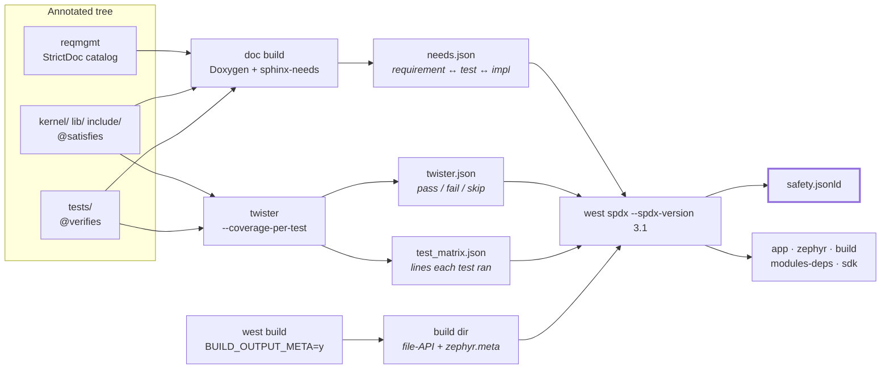
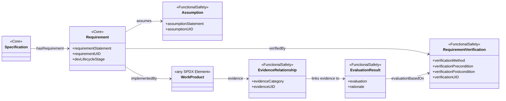
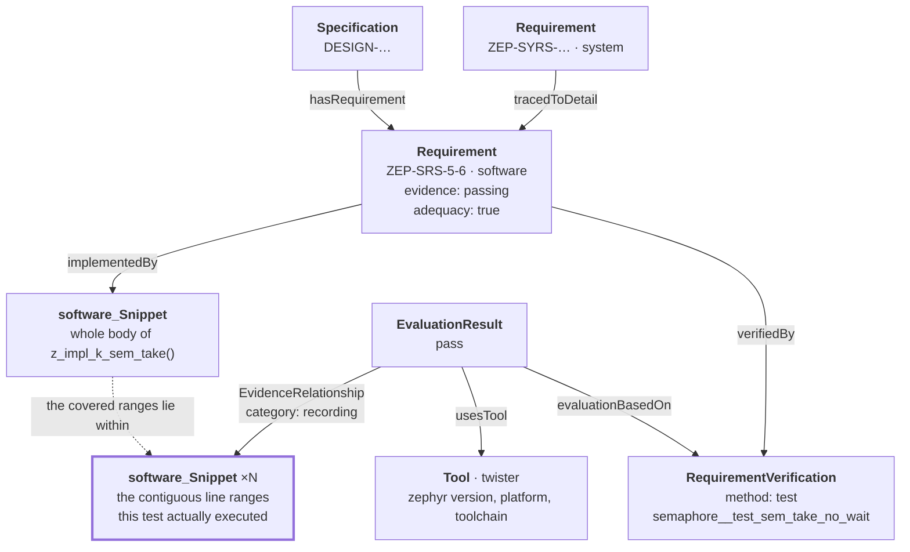

<!--
SPDX-FileCopyrightText: Copyright The Zephyr Project Contributors
SPDX-License-Identifier: Apache-2.0
-->

# The safety SBOM at a glance

Companion to [SPDX-3.1-REPRO.md](SPDX-3.1-REPRO.md), which has the full recipe. This one is
the *what and why*, short enough to talk through.

## The claim

A normal SBOM answers **"what is in this build"**. The safety document adds **"which
requirements this code implements, which tests verify them, and whether those tests actually
executed the implementing lines"** — and that last part is the one a declaration-only
traceability tool cannot answer. It comes out as standard SPDX 3.1 FunctionalSafety
elements in `safety.jsonld`, alongside the five ordinary BOM documents, so an assessor gets
the requirement evidence and the component inventory in one artifact set.

## What goes into it

Three hand-maintained things, and nothing else:

| Input | Looks like | Contributes |
| --- | --- | --- |
| The `reqmgmt` StrictDoc catalog | `ZEP-SRS-5-6`, with statement, rationale, component, status | the requirements — 580 software + 39 system |
| `@satisfies` on an API | on `k_sem_take()` in `include/zephyr/kernel.h` | requirement → implementation |
| `@verifies` on a ztest case | on `ZTEST_USER(semaphore, test_sem_take_no_wait)` | requirement → test |

One real, complete triple — `ZEP-SRS-5-6`, its implementation and its verifier:

```c
/** @satisfies ZEP-SRS-5-6 */                 /** @verifies ZEP-SRS-5-6 */
__syscall int k_sem_take(struct k_sem *sem,   ZTEST_USER(semaphore, test_sem_take_no_wait)
                         k_timeout_t timeout);
```

Everything else — the bodies, the line ranges, the pass/fail, the verdicts — is derived.

## How it is built

Three independent runs produce three JSON files; one `west spdx` invocation joins them.



The point worth making out loud: **none of the three safety inputs come from the application
build.** `west spdx` is pointed at a build directory for the component inventory; the safety
graph is assembled from a documentation build and a test campaign. Drop one input and the
document degrades quietly rather than failing — so read the counts `west spdx` prints.

```bash
west spdx -d "$APPBUILD" --spdx-version 3.1 \
  --requirements-dir "$REQDIR" \
  --traceability "$DOCBUILD/html/needs.json" \
  --twister-json "$TWOUT/twister.json" \
  --coverage "$TWOUT/coverage/test_matrix.json" -s "$OUT"
```

## What comes out

### The profile, as SPDX defines it



`WorkProduct` is the open slot: the profile lets *any* SPDX element be the thing a requirement
is implemented by and the thing offered as evidence. Zephyr puts a `software_Snippet` in both
positions — a function body for the implementation, a covered line range for the evidence —
which is what turns the profile from a declaration format into a measurement. `Assumption` is
the one class not emitted yet.

### The same graph, filled in for one Zephyr requirement



`COV` is the whole idea. A declared link says a test *claims* to verify a requirement; those
snippets say which lines of the implementation it *ran*. Each snippet is one contiguous
covered range inside a resolved body, so two tests hitting different paths through
`k_sem_take()` reference different snippets. Implementation bodies are resolved against the
commit recorded in the twister run, since coverage line numbers are only meaningful there.

Syscall APIs resolve to several bodies (`z_impl_`, `z_vrfy_`, header `static inline`); a
symbol counts as exercised when any of them is.

## The two verdicts

Every software requirement carries both, as `evidence:` / `adequacy:` external identifiers
plus a plain-English comment. Counts are the 2026-08-30 reference run, over 580 software
requirements.

**Evidence** — did the verifying tests run, and pass? (twister results only)

| Verdict | Count | Meaning |
| --- | ---: | --- |
| `passing` | 364 | every verifying test that ran passed |
| `untested` | 154 | nothing claims to verify it |
| `no-run` | 45 | it has verifying tests, but none ran in this campaign |
| `skipped` | 12 | the verifying tests were all skipped |
| `failing` | 5 | at least one verifying test failed |

**Adequacy** — the true-traceability question: did those tests execute the implementing code?

| Verdict | Count | Meaning |
| --- | ---: | --- |
| `true` | 229 | every resolved implementing symbol is exercised by this requirement's own tests |
| `partial` | 4 | some symbols exercised, others not |
| **`broken`** | **4** | the implementation runs only under *other* tests — **verified on paper, not in fact** |
| `unattributed` | 9 | no test in the run reaches it (boot-time, inlined away, config'd out) |
| `no-cov` | 41 | the verifying tests produced no coverage in this run |
| `unresolved` | 64 | the link lands on a macro or inline, not a body |
| `no-impl` | 229 | no `@satisfies` link yet |

`broken` is the slide to linger on: four requirements whose test suite passes and whose
traceability matrix is green, but whose implementing lines are never reached by the tests
that claim them. A declaration-only traceability tool reports those as fully verified.

## Reference run

`safety.jsonld` — 5.2 MB, 7554 elements:

| Element | Count |
| --- | ---: |
| `Requirement` | 619 — 580 software, 39 system |
| `Specification` | 77 |
| `functionalsafety_RequirementVerification` | 769 |
| `functionalsafety_EvaluationResult` | 769 |
| `functionalsafety_EvidenceRelationship` | 440 |
| `software_Snippet` | 1469 |

The 769 verifications are the annotated tests this campaign actually measured, out of 883 in
the graph and 1144 results in the run.

Cross-checked against the [true-traceability
dashboard](https://testing.zephyrproject.org/true-traceability/index.html): on the 491
requirements both campaigns cover, **both verdicts agree for every single one**. The 25 that
differ all have a verifier the dashboard's campaign never runs.

## Caveats worth pre-empting

* SPDX 3.1 ships the `functionalsafety_*` classes but its profile enumeration has no
  `functionalSafety` member, so the document carries the elements while declaring only
  `core, software` conformance.
* `safety.jsonld` has no `software_Sbom` root yet — the other five documents do.
* Verdicts are only as good as the campaign: a requirement whose tests were never run reads
  `no-run` / `no-cov`, not `broken`.
