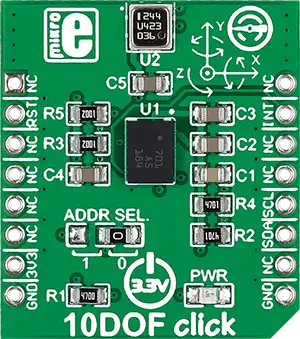

.. _mikroe_10dof_click_shield:

MikroElektronika 10DOF Click
============================

Overview
********

`10DOF Click`_ is a compact add-on board for enhancing hardware prototypes with 10DOF functionality
(10 degrees of freedom). This board features the BNO055, an intelligent 9-axis absolute orientation
sensor from Bosch Sensortec. In addition, it also features the BMP180, a digital pressure sensor
from Bosch Sensortec. These two sensors bring you three axes for measuring the acceleration and
orientation, three axes for measuring the angular velocity, three axes for measuring the direction
of a magnetic field around the device, and one pressure value for determining the altitude. This
Click board™ makes the perfect solution for augmented reality, navigation, gaming, robotics, or
industrial applications.

   10DOF Click

Requirements
************

This shield can only be used with a board that provides a mikroBUS |trade| socket and defines a
``mikrobus_i2c`` node label for the mikroBUS™ I2C interface. See :ref:`shields` for more details.

Programming
**********

Set ``-DSHIELD=mikroe_10dof_click`` when you invoke ``west build``. For example:

.. zephyr-app-commands::
   :zephyr-app: samples/sensor/sensor_shell
   :board: lpcxpresso55s16
   :shield: mikroe_10dof_click
   :goals: build

This will build the :zephyr:code-sample:`sensor_shell` sample which provides a quick way to verify
the shield is working correctly. After flashing, you can use the ``sensor`` command to list
available sensors and read their values.

References
**********

- `10DOF Click`_

.. _10DOF Click: https://www.mikroe.com/10dof-click
