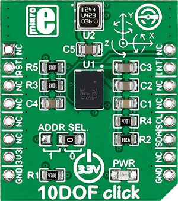

.. _shield_mikroe_10dof_click:

10DOF Click Shield
==================

Overview
********

The 10DOF Click shield carries a 10DOF board from MikroElektronika.

   10DOF Click

Requirements
************

This shield can only be used with a board which provides a configuration
for Arduino connectors and defines node aliases for Arduino's I2C and SPI.

Programming
**********

Set ``-DSHIELD=mikroe_10dof_click`` when you invoke ``west build``. For example:

.. zephyr-app-commands::
   :zephyr-app: samples/sensor/
   :board: nrf52840dk_nrf52840
   :shield: mikroe_10dof_click
   :goals: build

References
**********

- `10DOF Click webpage`_
- `10DOF Click schematic`_

.. _10DOF Click webpage: https://www.mikroe.com/10dof-click
.. _10DOF Click schematic: https://download.mikroe.com/documents/add-on-boards/click/10dof-click/
