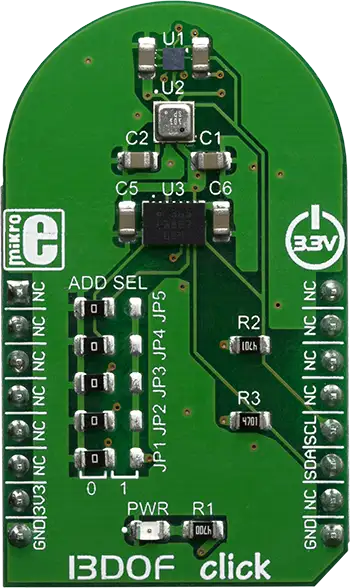

.. _mikroe_13dof_2_click:

MikroElektronika 13DOF-2 Click
==============================

Overview
********

The BME680 is a digital 4-in-1 sensor with VOC, humidity, pressure and temperature measurement based
on proven sensing principles, housed in an extremely compact metal-lid LGA package. Its small
dimensions and its low power consumption enable the integration in battery-powered or frequency-
coupled devices, such as handsets or wearables. The BMX160 is a highly integrated, low power 9-axis
sensor that provides precise acceleration and angular rate (gyroscopic) and geomagnetic measurement
in each spatial direction. It integrates the 16-bit digital, triaxial accelerometer, 16-bit digital,
triaxial gyroscope, and a geomagnetic sensor. 13DOF 2 click has these two ICs integrated onboard,
which makes it a very powerful motion and sensing applications designing tool.

   13DOF-2 Click

Requirements
************

This shield can only be used with a board that provides a mikroBUS™ socket and defines a
``mikrobus_i2c`` node label for the mikroBUS™ I2C interface. See :ref:`shields` for more details.

Programming
**********

Set ``-DSHIELD=mikroe_13dof_2_click`` when you invoke ``west build``. For example:

.. zephyr-app-commands::
   :zephyr-app: samples/sensor/sensor_shell
   :board: lpcxpresso55s16
   :shield: mikroe_13dof_2_click
   :goals: build

This will build the :zephyr:code-sample:`sensor_shell` sample which provides a quick way to verify
the shield is working correctly. After flashing, you can use the ``sensor`` command to list
available sensors and read their values.

References
**********

- `13DOF-2 Click webpage`_
- `13DOF-2 Click schematic`_

.. _13DOF-2 Click webpage: https://www.mikroe.com/13dof-2-click
.. _13DOF-2 Click schematic: https://download.mikroe.com/documents/add-on-boards/click/13dof_2_click/13DOF-2-click-schematic-v100.pdf
