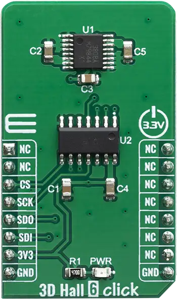

.. _mikroe_3d_hall_6_click:

MikroElektronika 3D-HALL-6 Click
================================

Overview
********

The features such as the Triaxis® Hall Technology, Output Refresh Rate (4µs typical) Selectable
Magnetic Field Axis (X/Y - X/Z - Z/Y) and wide measurement range all make this sensor a perfect
choice for various IoT applications, and because of very good accuracy of the spatial magnetic
sensor, perfectly suited for the development of various position sensing applications, contactless
knobs, encoders, switches, and potentiometers, or some other type of magnetic field measuring
application, based on an accurate spatial sensing.

   3D-HALL-6 Click

Requirements
************

This shield can only be used with a board that provides a mikroBUS™ socket and defines a
``mikrobus_spi`` node label for the mikroBUS™ SPI interface. See :ref:`shields` for more details.

Programming
**********

Set ``-DSHIELD=mikroe_3d_hall_6_click`` when you invoke ``west build``. For example:

.. zephyr-app-commands::
   :zephyr-app: samples/sensor/sensor_shell
   :board: lpcxpresso55s16
   :shield: mikroe_3d_hall_6_click
   :goals: build

This will build the :zephyr:code-sample:`sensor_shell` sample which provides a quick way to verify
the shield is working correctly. After flashing, you can use the ``sensor`` command to list
available sensors and read their values.

References
**********

- `3D-HALL-6 Click webpage`_

.. _3D-HALL-6 Click webpage: https://www.mikroe.com/3d-hall-6-click
