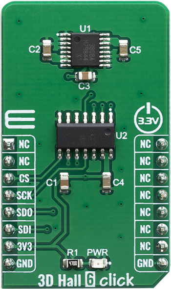

.. _shield_mikroe_3d_hall_6_click:

3D-HALL-6 Click Shield
======================

Overview
********

The 3D-HALL-6 Click shield carries a 3D-HALL-6 board from MikroElektronika.

   3D-HALL-6 Click

Requirements
************

This shield can only be used with a board which provides a configuration
for Arduino connectors and defines node aliases for Arduino's I2C and SPI.

Programming
**********

Set ``-DSHIELD=mikroe_3d_hall_6_click`` when you invoke ``west build``. For example:

.. zephyr-app-commands::
   :zephyr-app: samples/sensor/
   :board: nrf52840dk_nrf52840
   :shield: mikroe_3d_hall_6_click
   :goals: build

References
**********

- `3D-HALL-6 Click webpage`_
- `3D-HALL-6 Click schematic`_

.. _3D-HALL-6 Click webpage: https://www.mikroe.com/3d-hall-6-click
.. _3D-HALL-6 Click schematic: https://download.mikroe.com/documents/add-on-boards/click/3d-hall-6-click/
