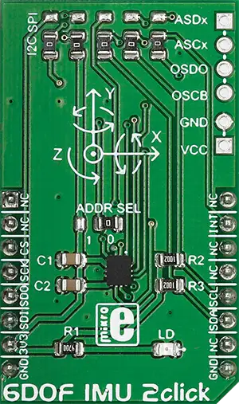

.. _mikroe_6dof_imu_2_click:

MikroElektronika 6DOF-IMU-2 Click
=================================

Overview
********

The 6DOF-IMU-2 Click shield carries a 6DOF-IMU-2 board from MikroElektronika.

   6DOF-IMU-2 Click

Requirements
************

This shield can only be used with a board that provides a mikroBUS™ socket and defines a
``mikrobus_i2c`` node label for the mikroBUS™ I2C interface. See :ref:`shields` for more details.

Programming
**********

Set ``-DSHIELD=mikroe_6dof_imu_2_click`` when you invoke ``west build``. For example:

.. zephyr-app-commands::
   :zephyr-app: samples/sensor/sensor_shell
   :board: lpcxpresso55s16
   :shield: mikroe_6dof_imu_2_click
   :goals: build

This will build the :zephyr:code-sample:`sensor_shell` sample which provides a quick way to verify
the shield is working correctly. After flashing, you can use the ``sensor`` command to list
available sensors and read their values.

References
**********

- `6DOF-IMU-2 Click webpage`_

.. _6DOF-IMU-2 Click webpage: https://www.mikroe.com/6dof-imu-2-click
