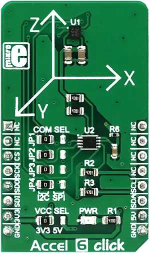

.. _mikroe_accel_6_click:

MikroElektronika ACCEL-6 Click
==============================

Overview
********

Accel 6 click is a three-axis acceleration sensor with many features. It uses the BMA280, a 14bit
triaxial acceleration sensor with intelligent on-chip motion triggered interrupt controller, from
Bosch Sensortec. This sensor has an advanced set of features, that allows easy acceleration
measurement in three perpendicular axes for up to ±16g, with selectable max range steps for
increased accuracy. Using lowpass filter allows filtering of the abrupt changes in acceleration
readings. FIFO buffer ensures reliable and fast data delivery. Intelligent interrupt engine allows
detection of motion, inactivity, shock vibration, new data arrival, and more.

   ACCEL-6 Click

Requirements
************

This shield can only be used with a board that provides a mikroBUS™ socket and defines a
``mikrobus_i2c`` node label for the mikroBUS™ I2C interface. See :ref:`shields` for more details.

Programming
**********

Set ``-DSHIELD=mikroe_accel_6_click`` when you invoke ``west build``. For example:

.. zephyr-app-commands::
   :zephyr-app: samples/sensor/sensor_shell
   :board: lpcxpresso55s16
   :shield: mikroe_accel_6_click
   :goals: build

This will build the :zephyr:code-sample:`sensor_shell` sample which provides a quick way to verify
the shield is working correctly. After flashing, you can use the ``sensor`` command to list
available sensors and read their values.

References
**********

- `ACCEL-6 Click webpage`_
- `ACCEL-6 Click schematic`_

.. _ACCEL-6 Click webpage: https://www.mikroe.com/accel-6-click
.. _ACCEL-6 Click schematic: https://download.mikroe.com/documents/add-on-boards/click/accel-6/accel-6-click-schematic-v101.pdf
