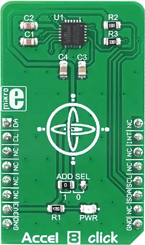

.. _mikroe_accel_8_click:

MikroElektronika ACCEL-8 Click
==============================

Overview
********

MPU6050 is produced utilizing the innovative Nasiri Fabrication platform, specialized in MEMS
production and its integration with accompanying logic sections, on a wafer level. This allows very
high integration and very small dimensions, at an affordable cost. Besides the size, features such
as low power consumption, high precision of motion detection, high shock tolerance, and programming
capabilities, make it a MotionInterface™ enabled device, which can be used for development of
different types of motion detection based applications, including gesture command, augmented
reality, vehicle navigation, image stabilization in photography, and other similar applications.

   ACCEL-8 Click

Requirements
************

This shield can only be used with a board that provides a mikroBUS™ socket and defines a
``mikrobus_i2c`` node label for the mikroBUS™ I2C interface. See :ref:`shields` for more details.

Programming
**********

Set ``-DSHIELD=mikroe_accel_8_click`` when you invoke ``west build``. For example:

.. zephyr-app-commands::
   :zephyr-app: samples/sensor/sensor_shell
   :board: lpcxpresso55s16
   :shield: mikroe_accel_8_click
   :goals: build

This will build the :zephyr:code-sample:`sensor_shell` sample which provides a quick way to verify
the shield is working correctly. After flashing, you can use the ``sensor`` command to list
available sensors and read their values.

References
**********

- `ACCEL-8 Click webpage`_
- `ACCEL-8 Click schematic`_

.. _ACCEL-8 Click webpage: https://www.mikroe.com/accel-8-click
.. _ACCEL-8 Click schematic: https://download.mikroe.com/documents/add-on-boards/click/accel-8/accel-8-schematic-v100.pdf
