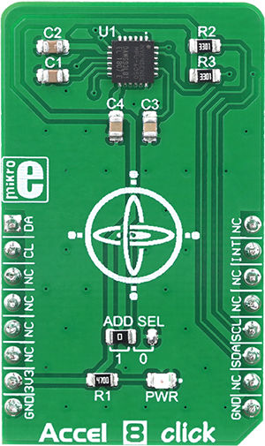

.. _shield_mikroe_accel_8_click:

ACCEL-8 Click Shield
====================

Overview
********

The ACCEL-8 Click shield carries a ACCEL-8 board from MikroElektronika.

   ACCEL-8 Click

Requirements
************

This shield can only be used with a board which provides a configuration
for Arduino connectors and defines node aliases for Arduino's I2C and SPI.

Programming
**********

Set ``-DSHIELD=mikroe_accel_8_click`` when you invoke ``west build``. For example:

.. zephyr-app-commands::
   :zephyr-app: samples/sensor/
   :board: nrf52840dk_nrf52840
   :shield: mikroe_accel_8_click
   :goals: build

References
**********

- `ACCEL-8 Click webpage`_
- `ACCEL-8 Click schematic`_

.. _ACCEL-8 Click webpage: https://www.mikroe.com/accel-8-click
.. _ACCEL-8 Click schematic: https://download.mikroe.com/documents/add-on-boards/click/accel-8-click/
