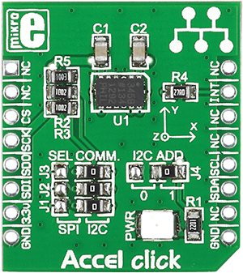

.. _shield_mikroe_accel_click:

ACCEL Click Shield
==================

Overview
********

The ACCEL Click shield carries a ACCEL board from MikroElektronika.

   ACCEL Click

Requirements
************

This shield can only be used with a board which provides a configuration
for Arduino connectors and defines node aliases for Arduino's I2C and SPI.

Programming
**********

Set ``-DSHIELD=mikroe_accel_click`` when you invoke ``west build``. For example:

.. zephyr-app-commands::
   :zephyr-app: samples/sensor/
   :board: nrf52840dk_nrf52840
   :shield: mikroe_accel_click
   :goals: build

References
**********

- `ACCEL Click webpage`_
- `ACCEL Click schematic`_

.. _ACCEL Click webpage: https://www.mikroe.com/accel-click
.. _ACCEL Click schematic: https://download.mikroe.com/documents/add-on-boards/click/accel-click/
