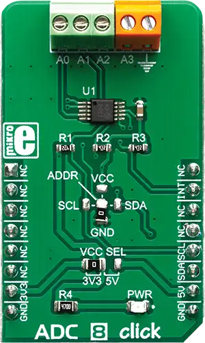

.. _mikroe_adc_8_click:

MikroElektronika ADC-8 Click
============================

Overview
********

ADS1115 can operate either in continuous or in a single-shot mode. While operating in a single-shot
mode, the current consumption is significantly reduced, since the ADS1115 powers down after each
conversion. Its maximum sample rate in continuous mode is up to 860 SPS. An overvoltage on the input
can be detected and reported over the ALERT pin. These features, along with the selectable operating
voltage (3.3V or 5V), make the ADC 8 click perfectly suited for portable instrumentation
applications, battery voltage, and current monitoring, analog sensor output conversion, etc.

   ADC-8 Click

Requirements
************

This shield can only be used with a board that provides a mikroBUS™ socket and defines a
``mikrobus_i2c`` node label for the mikroBUS™ I2C interface. See :ref:`shields` for more details.

Programming
**********

Set ``-DSHIELD=mikroe_adc_8_click`` when you invoke ``west build``. For example:

.. zephyr-app-commands::
   :zephyr-app: samples/sensor/sensor_shell
   :board: lpcxpresso55s16
   :shield: mikroe_adc_8_click
   :goals: build

This will build the :zephyr:code-sample:`sensor_shell` sample which provides a quick way to verify
the shield is working correctly. After flashing, you can use the ``sensor`` command to list
available sensors and read their values.

References
**********

- `ADC-8 Click webpage`_
- `ADC-8 Click schematic`_

.. _ADC-8 Click webpage: https://www.mikroe.com/adc-8-click
.. _ADC-8 Click schematic: https://download.mikroe.com/documents/add-on-boards/click/adc-8/ADC-8-click-schematic-v100.pdf
