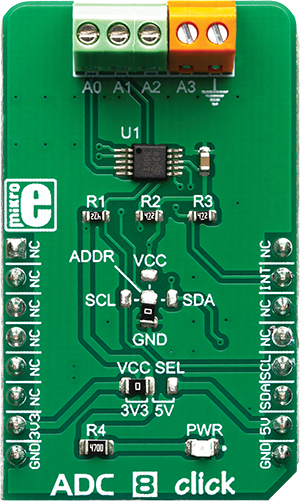

.. _shield_mikroe_adc_8_click:

ADC-8 Click Shield
==================

Overview
********

The ADC-8 Click shield carries a ADC-8 board from MikroElektronika.

   ADC-8 Click

Requirements
************

This shield can only be used with a board which provides a configuration
for Arduino connectors and defines node aliases for Arduino's I2C and SPI.

Programming
**********

Set ``-DSHIELD=mikroe_adc_8_click`` when you invoke ``west build``. For example:

.. zephyr-app-commands::
   :zephyr-app: samples/sensor/
   :board: nrf52840dk_nrf52840
   :shield: mikroe_adc_8_click
   :goals: build

References
**********

- `ADC-8 Click webpage`_
- `ADC-8 Click schematic`_

.. _ADC-8 Click webpage: https://www.mikroe.com/adc-8-click
.. _ADC-8 Click schematic: https://download.mikroe.com/documents/add-on-boards/click/adc-8-click/
