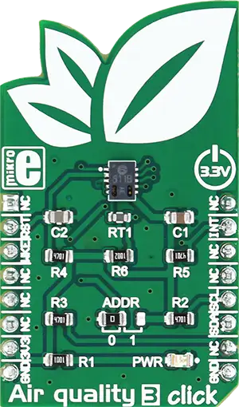

.. _mikroe_air_quality_3_click_shield:

MikroElektronika Air Quality 3 Click
====================================

Overview
********

`Air Quality 3 Click`_ is the air quality measurement device, which is able to output both
equivalent CO2 levels and total volatile organic compounds (TVOC) concentration in the indoor
environment. The Click board™ is equipped with the state-of-the-art air quality sensor IC, which has
an integrated MCU and a specially designed metal oxide (MOX) gas sensor microplate, allowing for
high reliability, fast cycle times and a significant reduction in the power consumption, compared to
other MOX sensor-based devices. The Click board™ is also equipped with a temperature compensating
element, which allows for increased measurement accuracy.

   Air Quality 3 Click

Requirements
************

This shield can only be used with a board that provides a mikroBUS |trade| socket and defines a
``mikrobus_i2c`` node label for the mikroBUS™ I2C interface. See :ref:`shields` for more details.

Programming
**********

Set ``-DSHIELD=mikroe_air_quality_3_click`` when you invoke ``west build``. For example:

.. zephyr-app-commands::
   :zephyr-app: samples/sensor/sensor_shell
   :board: lpcxpresso55s16
   :shield: mikroe_air_quality_3_click
   :goals: build

This will build the :zephyr:code-sample:`sensor_shell` sample which provides a quick way to verify
the shield is working correctly. After flashing, you can use the ``sensor`` command to list
available sensors and read their values.

References
**********

- `Air Quality 3 Click`_
- `Air Quality 3 Click schematic`_

.. _Air Quality 3 Click: https://www.mikroe.com/air-quality-3-click
.. _Air Quality 3 Click schematic: https://download.mikroe.com/documents/add-on-boards/click/air-quality-3/air-quality-3-click-schematic-v100.pdf
