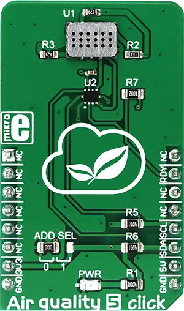

.. _mikroe_air_quality_5_click:

MikroElektronika AIR-QUALITY-5 Click
====================================

Overview
********

Air quality 5 click is a triple MOS sensor on a single Click board™, which can detect gas pollution
for a number of different gases. The onboard sensor is specially designed to detect the pollution
from automobile exhausts, as well as the gas pollution from the industrial or agricultural industry.
This Click board™ uses the MiCS-6814, a compact MOS sensor with three fully independent sensing
elements in one package: RED sensor, OX sensor, and NH3 sensor. Each of these sensors reacts with
the specific type of gases, providing gas readings that including carbon monoxide (CO), nitrogen
dioxide (NO2), ethanol (C2H5OH), hydrogen (H2), ammonia (NH3), methane (CH4), propane (C3H8), and
isobutane (C4H10). Measurement conversion is handled by the onboard 12bit ADC converter and it is
available via the I2C interface.

   AIR-QUALITY-5 Click

Requirements
************

This shield can only be used with a board that provides a mikroBUS™ socket and defines a
``mikrobus_i2c`` node label for the mikroBUS™ I2C interface. See :ref:`shields` for more details.

Programming
**********

Set ``-DSHIELD=mikroe_air_quality_5_click`` when you invoke ``west build``. For example:

.. zephyr-app-commands::
   :zephyr-app: samples/sensor/sensor_shell
   :board: lpcxpresso55s16
   :shield: mikroe_air_quality_5_click
   :goals: build

This will build the :zephyr:code-sample:`sensor_shell` sample which provides a quick way to verify
the shield is working correctly. After flashing, you can use the ``sensor`` command to list
available sensors and read their values.

References
**********

- `AIR-QUALITY-5 Click webpage`_
- `AIR-QUALITY-5 Click schematic`_

.. _AIR-QUALITY-5 Click webpage: https://www.mikroe.com/air-quality-5-click
.. _AIR-QUALITY-5 Click schematic: https://download.mikroe.com/documents/add-on-boards/click/air-quality-5/air-quality-5-click-schematic-v101.pdf
