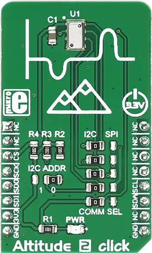

.. _mikroe_altitude_2_click:

MikroElektronika ALTITUDE-2 Click
=================================

Overview
********

Altitude 2 click is a high-resolution barometric pressure sensor Click board™. It provides very
accurate measurements of temperature and atmospheric pressure, which can be used to calculate the
altitude with a very high resolution of 20cm per step. Besides that, the device also includes
features such as the ultra-low noise delta-sigma 24bit ADC, low power consumption, fast conversion
times, pre-programmed unique compensation values, and more. Low count of external components
requirement, along with the simple interface which requires no extensive configuration programming,
makes this sensor very attractive for building altitude or air pressure measuring applications.

   ALTITUDE-2 Click

Requirements
************

This shield can only be used with a board that provides a mikroBUS™ socket and defines a
``mikrobus_i2c`` node label for the mikroBUS™ I2C interface. See :ref:`shields` for more details.

Programming
**********

Set ``-DSHIELD=mikroe_altitude_2_click`` when you invoke ``west build``. For example:

.. zephyr-app-commands::
   :zephyr-app: samples/sensor/sensor_shell
   :board: lpcxpresso55s16
   :shield: mikroe_altitude_2_click
   :goals: build

This will build the :zephyr:code-sample:`sensor_shell` sample which provides a quick way to verify
the shield is working correctly. After flashing, you can use the ``sensor`` command to list
available sensors and read their values.

References
**********

- `ALTITUDE-2 Click webpage`_

.. _ALTITUDE-2 Click webpage: https://www.mikroe.com/altitude-2-click
