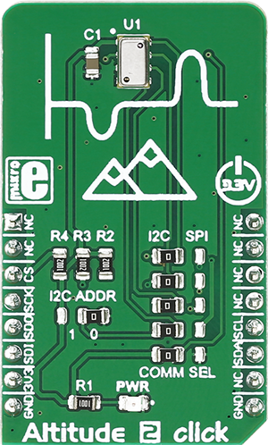

.. _shield_mikroe_altitude_2_click:

ALTITUDE-2 Click Shield
=======================

Overview
********

The ALTITUDE-2 Click shield carries a ALTITUDE-2 board from MikroElektronika.

   ALTITUDE-2 Click

Requirements
************

This shield can only be used with a board which provides a configuration
for Arduino connectors and defines node aliases for Arduino's I2C and SPI.

Programming
**********

Set ``-DSHIELD=mikroe_altitude_2_click`` when you invoke ``west build``. For example:

.. zephyr-app-commands::
   :zephyr-app: samples/sensor/
   :board: nrf52840dk_nrf52840
   :shield: mikroe_altitude_2_click
   :goals: build

References
**********

- `ALTITUDE-2 Click webpage`_
- `ALTITUDE-2 Click schematic`_

.. _ALTITUDE-2 Click webpage: https://www.mikroe.com/altitude-2-click
.. _ALTITUDE-2 Click schematic: https://download.mikroe.com/documents/add-on-boards/click/altitude-2-click/
