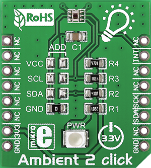

.. _shield_mikroe_ambient_2_click:

AMBIENT-2 Click Shield
======================

Overview
********

The AMBIENT-2 Click shield carries a AMBIENT-2 board from MikroElektronika.

   AMBIENT-2 Click

Requirements
************

This shield can only be used with a board which provides a configuration
for Arduino connectors and defines node aliases for Arduino's I2C and SPI.

Programming
**********

Set ``-DSHIELD=mikroe_ambient_2_click`` when you invoke ``west build``. For example:

.. zephyr-app-commands::
   :zephyr-app: samples/sensor/
   :board: nrf52840dk_nrf52840
   :shield: mikroe_ambient_2_click
   :goals: build

References
**********

- `AMBIENT-2 Click webpage`_
- `AMBIENT-2 Click schematic`_

.. _AMBIENT-2 Click webpage: https://www.mikroe.com/ambient-2-click
.. _AMBIENT-2 Click schematic: https://download.mikroe.com/documents/add-on-boards/click/ambient-2-click/
