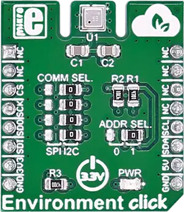

.. _mikroe_environment_click:

MikroElektronika ENVIRONMENT Click
==================================

Overview
********

Environment click measures temperature, relative humidity, pressure and VOC (Volatile Organic
compounds gases). The click carries the BME680 environmental sensor from Bosch. Environment click is
designed to run on a 3.3V power supply. It communicates with the target microcontroller over SPI or
I2C interface.

   ENVIRONMENT Click

Requirements
************

This shield can only be used with a board that provides a mikroBUS™ socket and defines a
``mikrobus_i2c`` node label for the mikroBUS™ I2C interface. See :ref:`shields` for more details.

Programming
**********

Set ``-DSHIELD=mikroe_environment_click`` when you invoke ``west build``. For example:

.. zephyr-app-commands::
   :zephyr-app: samples/sensor/sensor_shell
   :board: lpcxpresso55s16
   :shield: mikroe_environment_click
   :goals: build

This will build the :zephyr:code-sample:`sensor_shell` sample which provides a quick way to verify
the shield is working correctly. After flashing, you can use the ``sensor`` command to list
available sensors and read their values.

References
**********

- `ENVIRONMENT Click webpage`_
- `ENVIRONMENT Click schematic`_

.. _ENVIRONMENT Click webpage: https://www.mikroe.com/environment-click
.. _ENVIRONMENT Click schematic: https://download.mikroe.com/documents/add-on-boards/click/enviroment/enviroment-click-schematic-v100.pdf
