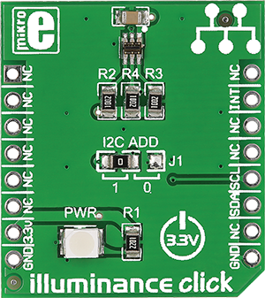

.. _shield_mikroe_illuminance_click:

ILLUMINANCE Click Shield
========================

Overview
********

The ILLUMINANCE Click shield carries a ILLUMINANCE board from MikroElektronika.

   ILLUMINANCE Click

Requirements
************

This shield can only be used with a board which provides a configuration
for Arduino connectors and defines node aliases for Arduino's I2C and SPI.

Programming
**********

Set ``-DSHIELD=mikroe_illuminance_click`` when you invoke ``west build``. For example:

.. zephyr-app-commands::
   :zephyr-app: samples/sensor/
   :board: nrf52840dk_nrf52840
   :shield: mikroe_illuminance_click
   :goals: build

References
**********

- `ILLUMINANCE Click webpage`_
- `ILLUMINANCE Click schematic`_

.. _ILLUMINANCE Click webpage: https://www.mikroe.com/illuminance-click
.. _ILLUMINANCE Click schematic: https://download.mikroe.com/documents/add-on-boards/click/illuminance-click/
