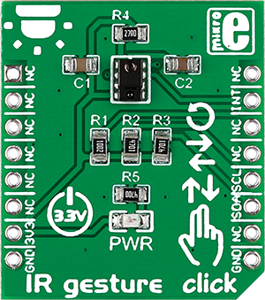

.. _shield_mikroe_ir_gesture_click:

IR-GESTURE Click Shield
=======================

Overview
********

The IR-GESTURE Click shield carries a IR-GESTURE board from MikroElektronika.

   IR-GESTURE Click

Requirements
************

This shield can only be used with a board which provides a configuration
for Arduino connectors and defines node aliases for Arduino's I2C and SPI.

Programming
**********

Set ``-DSHIELD=mikroe_ir_gesture_click`` when you invoke ``west build``. For example:

.. zephyr-app-commands::
   :zephyr-app: samples/sensor/
   :board: nrf52840dk_nrf52840
   :shield: mikroe_ir_gesture_click
   :goals: build

References
**********

- `IR-GESTURE Click webpage`_
- `IR-GESTURE Click schematic`_

.. _IR-GESTURE Click webpage: https://www.mikroe.com/ir-gesture-click
.. _IR-GESTURE Click schematic: https://download.mikroe.com/documents/add-on-boards/click/ir-gesture-click/
