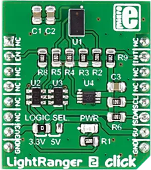

.. _mikroe_lightranger_2_click_shield:

MikroElektronika Lightranger 2 Click
====================================

Overview
********

`Lightranger 2 Click`_ is a compact add-on board with a ranging sensor for distance-sensing
applications.

This board features the VL53L0X, the world's smallest Time-of-Flight (ToF) ranging and gesture
detection sensor from STMicroelectronics. This laser-ranging module provides accurate distance
measurement, with absolute measurement distances up to 2m, whatever the target reflectances are. The
sensor is a Class 1 laser device compliant and is eye-safe.

   Lightranger 2 Click

Requirements
************

This shield can only be used with a board that provides a mikroBUS |trade| socket and defines a
``mikrobus_i2c`` node label for the mikroBUS |trade| I2C interface. See :ref:`shields` for more
details.

Programming
**********

Set ``-DSHIELD=mikroe_lightranger_2_click`` when you invoke ``west build``. For example:

.. zephyr-app-commands::
   :zephyr-app: samples/sensor/distance_polling
   :board: mikroe_clicker_ra4m1/r7fa4m1ab3cfm
   :shield: mikroe_lightranger_2_click
   :goals: build

References
**********

- `Lightranger 2 Click`_
- `Lightranger 2 Click schematic`_

.. _Lightranger 2 Click: https://www.mikroe.com/lightranger-2-click
.. _Lightranger 2 Click schematic: https://download.mikroe.com/documents/add-on-boards/click/lightranger-2/light-ranger-2-click-schematic-v100.pdf
