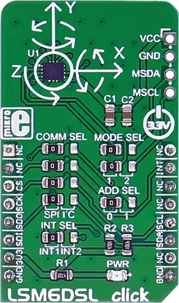

.. _mikroe_lsm6dsl_click:

MikroElektronika LSM6DSL Click
==============================

Overview
********

LSM6DSL click measures linear and angular velocity with six degrees of freedom. It carries the
LSM6DSL high-performance 3-axis digital accelerometer and 3-axis digital gyroscope. The click is
designed to run on a 3.3V power supply. LSM6DSL click communicates with the target microcontroller
over SPI or I2C interface, with additional functionality provided by the INT pin on the mikroBUS™
line.

   LSM6DSL Click

Requirements
************

This shield can only be used with a board that provides a mikroBUS™ socket and defines a
``mikrobus_spi`` node label for the mikroBUS™ SPI interface. See :ref:`shields` for more details.

Programming
**********

Set ``-DSHIELD=mikroe_lsm6dsl_click`` when you invoke ``west build``. For example:

.. zephyr-app-commands::
   :zephyr-app: samples/sensor/sensor_shell
   :board: lpcxpresso55s16
   :shield: mikroe_lsm6dsl_click
   :goals: build

This will build the :zephyr:code-sample:`sensor_shell` sample which provides a quick way to verify
the shield is working correctly. After flashing, you can use the ``sensor`` command to list
available sensors and read their values.

References
**********

- `LSM6DSL Click webpage`_
- `LSM6DSL Click schematic`_

.. _LSM6DSL Click webpage: https://www.mikroe.com/lsm6dsl-click
.. _LSM6DSL Click schematic: https://download.mikroe.com/documents/add-on-boards/click/lsm6dsl/lsm6dsl-click-schematic-v100.pdf
