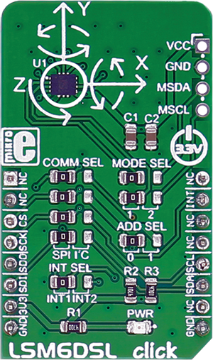

.. _shield_mikroe_lsm6dsl_click:

LSM6DSL Click Shield
====================

Overview
********

The LSM6DSL Click shield carries a LSM6DSL board from MikroElektronika.

   LSM6DSL Click

Requirements
************

This shield can only be used with a board which provides a configuration
for Arduino connectors and defines node aliases for Arduino's I2C and SPI.

Programming
**********

Set ``-DSHIELD=mikroe_lsm6dsl_click`` when you invoke ``west build``. For example:

.. zephyr-app-commands::
   :zephyr-app: samples/sensor/
   :board: nrf52840dk_nrf52840
   :shield: mikroe_lsm6dsl_click
   :goals: build

References
**********

- `LSM6DSL Click webpage`_
- `LSM6DSL Click schematic`_

.. _LSM6DSL Click webpage: https://www.mikroe.com/lsm6dsl-click
.. _LSM6DSL Click schematic: https://download.mikroe.com/documents/add-on-boards/click/lsm6dsl-click/
