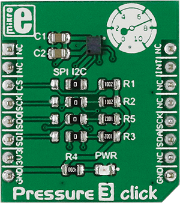

.. _shield_mikroe_pressure_3_click:

PRESSURE-3 Click Shield
=======================

Overview
********

The PRESSURE-3 Click shield carries a PRESSURE-3 board from MikroElektronika.

   PRESSURE-3 Click

Requirements
************

This shield can only be used with a board which provides a configuration
for Arduino connectors and defines node aliases for Arduino's I2C and SPI.

Programming
**********

Set ``-DSHIELD=mikroe_pressure_3_click`` when you invoke ``west build``. For example:

.. zephyr-app-commands::
   :zephyr-app: samples/sensor/
   :board: nrf52840dk_nrf52840
   :shield: mikroe_pressure_3_click
   :goals: build

References
**********

- `PRESSURE-3 Click webpage`_
- `PRESSURE-3 Click schematic`_

.. _PRESSURE-3 Click webpage: https://www.mikroe.com/pressure-3-click
.. _PRESSURE-3 Click schematic: https://download.mikroe.com/documents/add-on-boards/click/pressure-3-click/
