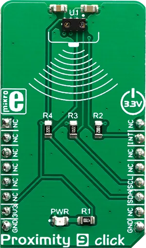

.. _mikroe_proximity_9_click:

MikroElektronika PROXIMITY-9 Click
==================================

Overview
********

The VCNL4040 also integrates some additional features for better reliability. It has an intelligent
crosstalk cancelation scheme implemented, in order to reduce the crosstalk phenomenon. A smart
persistence allows the interrupt engine to avoid false interrupt triggering. Rich with features,
this Click board™ can be used for a range of different applications which rely on the accurate and
reliable close proximity and ambient light sensing, including PC and laptop displays, POS displays,
embedded displays, proximity-activated short-range security, lux meters, etc.

   PROXIMITY-9 Click

Requirements
************

This shield can only be used with a board that provides a mikroBUS™ socket and defines a
``mikrobus_i2c`` node label for the mikroBUS™ I2C interface. See :ref:`shields` for more details.

Programming
**********

Set ``-DSHIELD=mikroe_proximity_9_click`` when you invoke ``west build``. For example:

.. zephyr-app-commands::
   :zephyr-app: samples/sensor/sensor_shell
   :board: lpcxpresso55s16
   :shield: mikroe_proximity_9_click
   :goals: build

This will build the :zephyr:code-sample:`sensor_shell` sample which provides a quick way to verify
the shield is working correctly. After flashing, you can use the ``sensor`` command to list
available sensors and read their values.

References
**********

- `PROXIMITY-9 Click webpage`_
- `PROXIMITY-9 Click schematic`_

.. _PROXIMITY-9 Click webpage: https://www.mikroe.com/proximity-9-click
.. _PROXIMITY-9 Click schematic: https://download.mikroe.com/documents/add-on-boards/click/proximity-9/proximity-9-click-schematic-v100.pdf
