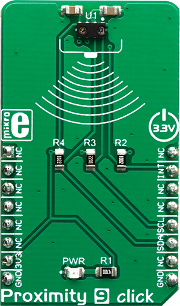

.. _shield_mikroe_proximity_9_click:

PROXIMITY-9 Click Shield
========================

Overview
********

The PROXIMITY-9 Click shield carries a PROXIMITY-9 board from MikroElektronika.

   PROXIMITY-9 Click

Requirements
************

This shield can only be used with a board which provides a configuration
for Arduino connectors and defines node aliases for Arduino's I2C and SPI.

Programming
**********

Set ``-DSHIELD=mikroe_proximity_9_click`` when you invoke ``west build``. For example:

.. zephyr-app-commands::
   :zephyr-app: samples/sensor/
   :board: nrf52840dk_nrf52840
   :shield: mikroe_proximity_9_click
   :goals: build

References
**********

- `PROXIMITY-9 Click webpage`_
- `PROXIMITY-9 Click schematic`_

.. _PROXIMITY-9 Click webpage: https://www.mikroe.com/proximity-9-click
.. _PROXIMITY-9 Click schematic: https://download.mikroe.com/documents/add-on-boards/click/proximity-9-click/
