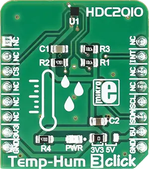

.. _mikroe_temp_hum_3_click:

MikroElektronika TEMP-HUM-3 Click
=================================

Overview
********

Temp&Hum 3 click is a smart environmental temperature and humidity sensor Click board™, packed with
features which allow easy and simple integration into any design that requires accurate and reliable
humidity and temperature measurements. The sensor IC has integrated sensing elements placed on the
bottom of the die, so they are not directly exposed to the environmental contamination. This
translates to a prolonged life of the Click board™ itself.

   TEMP-HUM-3 Click

Requirements
************

This shield can only be used with a board that provides a mikroBUS™ socket and defines a
``mikrobus_i2c`` node label for the mikroBUS™ I2C interface. See :ref:`shields` for more details.

Programming
**********

Set ``-DSHIELD=mikroe_temp_hum_3_click`` when you invoke ``west build``. For example:

.. zephyr-app-commands::
   :zephyr-app: samples/sensor/sensor_shell
   :board: lpcxpresso55s16
   :shield: mikroe_temp_hum_3_click
   :goals: build

This will build the :zephyr:code-sample:`sensor_shell` sample which provides a quick way to verify
the shield is working correctly. After flashing, you can use the ``sensor`` command to list
available sensors and read their values.

References
**********

- `TEMP-HUM-3 Click webpage`_
- `TEMP-HUM-3 Click schematic`_

.. _TEMP-HUM-3 Click webpage: https://www.mikroe.com/temp-hum-3-click
.. _TEMP-HUM-3 Click schematic: https://download.mikroe.com/documents/add-on-boards/click/temp-hum-3/temp-hum-3-click-schematic-v100.pdf
