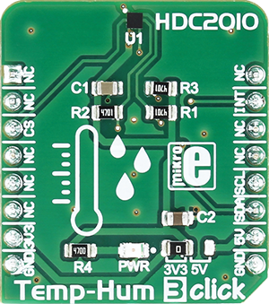

.. _shield_mikroe_temp_hum_3_click:

TEMP-HUM-3 Click Shield
=======================

Overview
********

The TEMP-HUM-3 Click shield carries a TEMP-HUM-3 board from MikroElektronika.

   TEMP-HUM-3 Click

Requirements
************

This shield can only be used with a board which provides a configuration
for Arduino connectors and defines node aliases for Arduino's I2C and SPI.

Programming
**********

Set ``-DSHIELD=mikroe_temp_hum_3_click`` when you invoke ``west build``. For example:

.. zephyr-app-commands::
   :zephyr-app: samples/sensor/
   :board: nrf52840dk_nrf52840
   :shield: mikroe_temp_hum_3_click
   :goals: build

References
**********

- `TEMP-HUM-3 Click webpage`_
- `TEMP-HUM-3 Click schematic`_

.. _TEMP-HUM-3 Click webpage: https://www.mikroe.com/temp-hum-3-click
.. _TEMP-HUM-3 Click schematic: https://download.mikroe.com/documents/add-on-boards/click/temp-hum-3-click/
