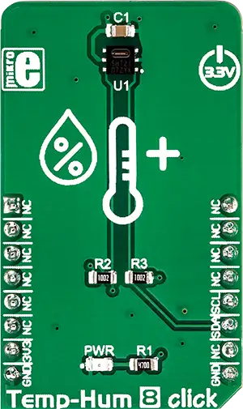

.. _mikroe_temp_hum_8_click:

MikroElektronika TEMP-HUM-8 Click
=================================

Overview
********

The programmable sensor resolution allows you to select between 8/12 bits and 12/14 bits (temp/hum),
which directly affects the power consumption. The sensor housing is made of epoxy with no Pb, Cd, or
Hg parts, which guarantees the reliability and compatibility of Temp&Hum 8 click with RoHS and WEEE
standards.

   TEMP-HUM-8 Click

Requirements
************

This shield can only be used with a board that provides a mikroBUS™ socket and defines a
``mikrobus_i2c`` node label for the mikroBUS™ I2C interface. See :ref:`shields` for more details.

Programming
**********

Set ``-DSHIELD=mikroe_temp_hum_8_click`` when you invoke ``west build``. For example:

.. zephyr-app-commands::
   :zephyr-app: samples/sensor/sensor_shell
   :board: lpcxpresso55s16
   :shield: mikroe_temp_hum_8_click
   :goals: build

This will build the :zephyr:code-sample:`sensor_shell` sample which provides a quick way to verify
the shield is working correctly. After flashing, you can use the ``sensor`` command to list
available sensors and read their values.

References
**********

- `TEMP-HUM-8 Click webpage`_
- `TEMP-HUM-8 Click schematic`_

.. _TEMP-HUM-8 Click webpage: https://www.mikroe.com/temp-hum-8-click
.. _TEMP-HUM-8 Click schematic: https://download.mikroe.com/documents/add-on-boards/click/temphum-8/temp-hum-8-click-schematic-v100.pdf
