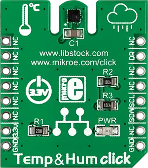

.. _mikroe_temp_hum_click_shield:

MikroElektronika Temp Hum Click
===============================

Overview
********

Temp&Hum Click carries ST’s HTS221 temperature and relative humidity sensor. Its temperature
measurement accuracy is ±1°C within a 0-60°C range.

   Temp Hum Click

Requirements
************

This shield can only be used with a board that provides a mikroBUS |trade| socket and defines a
``mikrobus_i2c`` node label for the mikroBUS™ I2C interface. See :ref:`shields` for more details.

Programming
**********

Set ``-DSHIELD=mikroe_temp_hum_click`` when you invoke ``west build``. For example:

.. zephyr-app-commands::
   :zephyr-app: samples/sensor/sensor_shell
   :board: lpcxpresso55s16
   :shield: mikroe_temp_hum_click
   :goals: build

This will build the :zephyr:code-sample:`sensor_shell` sample which provides a quick way to verify
the shield is working correctly. After flashing, you can use the ``sensor`` command to list
available sensors and read their values.

References
**********

- `Temp Hum Click`_

.. _Temp Hum Click: https://www.mikroe.com/temp-hum-click
