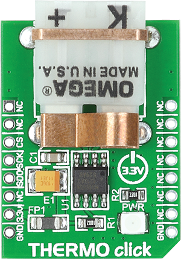

.. _shield_mikroe_thermo_12_click:

THERMO-12 Click Shield
======================

Overview
********

The THERMO-12 Click shield carries a THERMO-12 board from MikroElektronika.

   THERMO-12 Click

Requirements
************

This shield can only be used with a board which provides a configuration
for Arduino connectors and defines node aliases for Arduino's I2C and SPI.

Programming
**********

Set ``-DSHIELD=mikroe_thermo_12_click`` when you invoke ``west build``. For example:

.. zephyr-app-commands::
   :zephyr-app: samples/sensor/
   :board: nrf52840dk_nrf52840
   :shield: mikroe_thermo_12_click
   :goals: build

References
**********

- `THERMO-12 Click webpage`_
- `THERMO-12 Click schematic`_

.. _THERMO-12 Click webpage: https://www.mikroe.com/thermo-12-click
.. _THERMO-12 Click schematic: https://download.mikroe.com/documents/add-on-boards/click/thermo-12-click/
