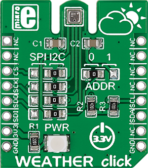

.. _shield_mikroe_weather_click:

WEATHER Click Shield
====================

Overview
********

The WEATHER Click shield carries a WEATHER board from MikroElektronika.

   WEATHER Click

Requirements
************

This shield can only be used with a board which provides a configuration
for Arduino connectors and defines node aliases for Arduino's I2C and SPI.

Programming
**********

Set ``-DSHIELD=mikroe_weather_click`` when you invoke ``west build``. For example:

.. zephyr-app-commands::
   :zephyr-app: samples/sensor/
   :board: nrf52840dk_nrf52840
   :shield: mikroe_weather_click
   :goals: build

References
**********

- `WEATHER Click webpage`_
- `WEATHER Click schematic`_

.. _WEATHER Click webpage: https://www.mikroe.com/weather-click
.. _WEATHER Click schematic: https://download.mikroe.com/documents/add-on-boards/click/weather-click/
