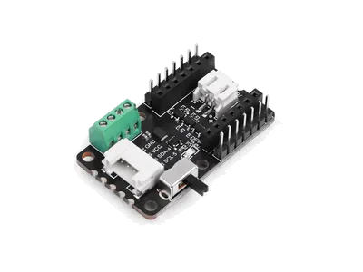

.. _seeed_xiao_cob_led:

Seeed Studio COB LED Driver Board for XIAO
##########################################

Overview
********

The `Seeed Studio COB LED Driver Board for XIAO`_ is a seven-channel lighting carrier for the
Seeed Studio XIAO family. It exposes two high-power switched outputs on D0 and D1 plus four
active-low PWM outputs on D2, D3, D8, and D9 for dimming effects.

   Seeed Studio COB LED Driver Board for XIAO (Credit: Seeed Studio)

Pin Assignments
===============

+----------------------+-----------------------------------------------------+
| XIAO pin             | Function                                            |
+======================+=====================================================+
| D0                   | High-power output 0, exposed through ``led0``       |
+----------------------+-----------------------------------------------------+
| D1                   | High-power output 1, exposed through ``led1``       |
+----------------------+-----------------------------------------------------+
| D2                   | PWM output 0, exposed through ``pwm-led0``          |
+----------------------+-----------------------------------------------------+
| D3                   | PWM output 1, exposed through ``pwm-led1``          |
+----------------------+-----------------------------------------------------+
| D8                   | PWM output 2, exposed through ``pwm-led2``          |
+----------------------+-----------------------------------------------------+
| D9                   | PWM output 3, exposed through ``pwm-led3``          |
+----------------------+-----------------------------------------------------+
| SDA / SCL            | Grove I2C connector                                 |
+----------------------+-----------------------------------------------------+

Requirements
************

This shield can be used with boards that expose the XIAO connector labels.

The shield definition always provides GPIO LED aliases for the two high-power outputs on D0 and D1.
The four low-power outputs require board-specific PWM routing because the PWM controller and pinctrl
configuration depend on the attached XIAO board.

A ready-made overlay is included for ``xiao_esp32s3/esp32s3/procpu`` at
:zephyr_file:`boards/shields/seeed_xiao_cob_led/boards/xiao_esp32s3_esp32s3_procpu.overlay`.

PWM configuration in application overlays
*****************************************

If your XIAO board does not already have a shield-specific overlay, add an application overlay that:

* enables a PWM controller that can drive D2, D3, D8, and D9,
* configures the board pinctrl so those pins are routed to the selected PWM channels,
* adds a ``pwm-leds`` node with one child per output, and
* defines ``pwm-led0`` through ``pwm-led3`` aliases for those child nodes.

The low-power outputs on this shield use active-low logic, so set ``PWM_POLARITY_INVERTED`` on each
``pwms`` entry.

The following pattern shows the expected alias and ``pwm-leds`` structure:

.. code-block:: devicetree

   #include <zephyr/dt-bindings/pwm/pwm.h>

   / {
           aliases {
                   pwm-led0 = &cob_pwm_led0;
                   pwm-led1 = &cob_pwm_led1;
                   pwm-led2 = &cob_pwm_led2;
                   pwm-led3 = &cob_pwm_led3;
           };

           cob_pwm_leds {
                   compatible = "pwm-leds";

                   cob_pwm_led0: pwm_led_0 {
                           pwms = <&your_pwm 0 PWM_MSEC(20) PWM_POLARITY_INVERTED>;
                   };

                   cob_pwm_led1: pwm_led_1 {
                           pwms = <&your_pwm 1 PWM_MSEC(20) PWM_POLARITY_INVERTED>;
                   };

                   cob_pwm_led2: pwm_led_2 {
                           pwms = <&your_pwm 2 PWM_MSEC(20) PWM_POLARITY_INVERTED>;
                   };

                   cob_pwm_led3: pwm_led_3 {
                           pwms = <&your_pwm 3 PWM_MSEC(20) PWM_POLARITY_INVERTED>;
                   };
           };
   };

Use the included ESP32-S3 shield overlay as a complete reference for the additional controller and
pinctrl changes needed on a specific board.

Programming
***********

Set ``--shield seeed_xiao_cob_led`` when invoking ``west build``.

For example, to use the high-power D0 output with :zephyr:code-sample:`blinky`:

.. zephyr-app-commands::
   :zephyr-app: samples/basic/blinky
   :board: xiao_esp32s3/esp32s3/procpu
   :shield: seeed_xiao_cob_led
   :goals: build

Or to use the first PWM output with :zephyr:code-sample:`blinky_pwm` on the board with the included
PWM routing overlay:

.. zephyr-app-commands::
   :zephyr-app: samples/basic/blinky_pwm
   :board: xiao_esp32s3/esp32s3/procpu
   :shield: seeed_xiao_cob_led
   :goals: build

.. _Seeed Studio COB LED Driver Board for XIAO:
   https://wiki.seeedstudio.com/getting_started_with_cob_led_dirver_board/
