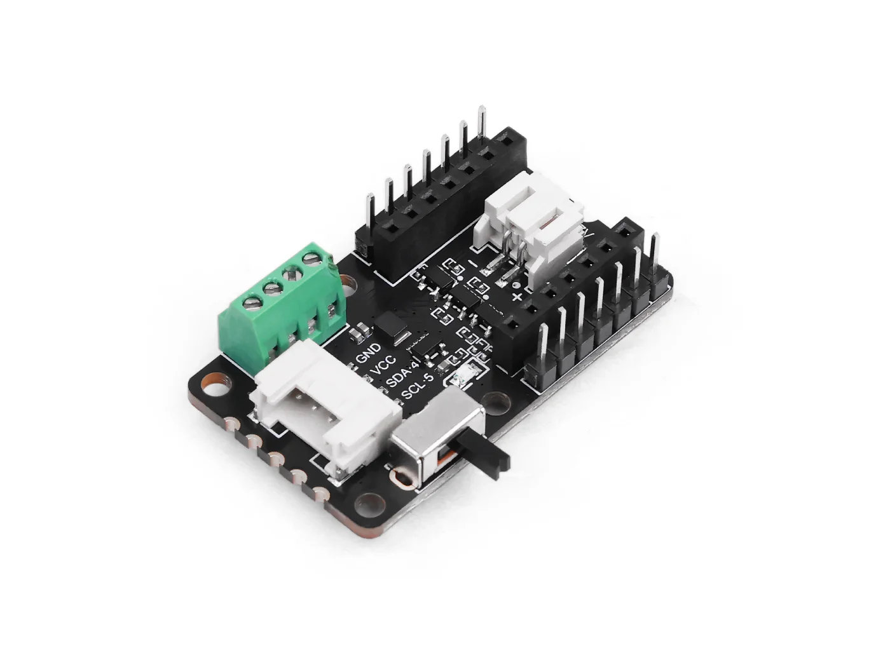

.. _seeed_xiao_cob_led_driver:

Seeed Studio COB LED Driver Board for XIAO
##########################################

Overview
********

The `COB LED Driver Board for Seeed Studio XIAO`_ (often sold as part of a COB LED
DIY kit) is a seven-channel driver dock for ultra-narrow 1 mm 3 V COB LED strips.
Three **high-power** outputs are switched from the XIAO (on/off only; no PWM on
those driver paths). Four **FX** outputs support dimming via PWM from the XIAO
(active-low gate drive). An onboard Grove connector brings out the XIAO I2C bus
for sensors. Battery and USB power paths are handled on the shield; follow Seeed’s
safety guidance when wiring or charging.

     COB LED Driver Board for XIAO (Credit: Seeed Studio)

.. _COB LED Driver Board for Seeed Studio XIAO: https://www.seeedstudio.com/COB-LED-Driver-Board-for-Seeed-Studio-XIAO-p-6602.html
.. _Seeed COB LED Driver wiki: https://wiki.seeedstudio.com/getting_started_with_cob_led_dirver_board/
.. _Seeed COB LED Driver schematic: https://files.seeedstudio.com/wiki/COBLED_Driver_Board_for_XIAO/SCH_Sch_V1.2_2025-11-21.pdf

References:

* `Seeed COB LED Driver wiki`_
* `Seeed COB LED Driver schematic`_ (PDF)

Safety
******

Follow the vendor documentation. In summary:

* Do not attach or disconnect COB strips or other peripherals while charging the battery.
* When using USB for programming or debugging, disconnect the battery first.
* Assemble the XIAO on the driver board before connecting USB; hot-plugging the XIAO
  while USB is powered can damage the PMIC.
* Total current above about 1 A may require airflow or enclosure venting to avoid
  thermal shutdown.

Devicetree mapping
******************

MCU-controlled outputs are modeled under the board’s ``leds`` node as ``gpio-leds``
children so they work with the LED API and GPIO polarity flags. **High-power**
channels are active-high; **FX** channels are active-low (strip on when the line
is driven low), matching the `Seeed COB LED Driver wiki`_.

Devicetree node labels: ``cob_led_hp_d0``, ``cob_led_hp_d1``, ``cob_led_fx_d2``,
``cob_led_fx_d3``, ``cob_led_fx_d8``, ``cob_led_fx_d9``.

Aliases: ``cob-led-hp-d0``, ``cob-led-hp-d1``, ``cob-led-fx-d2``, ``cob-led-fx-d3``,
``cob-led-fx-d8``, ``cob-led-fx-d9``.

The shield does **not** change ``led0``; on boards that define an on-module user LED,
it remains the default ``led0`` for samples such as :zephyr:code-sample:`blinky`.
Boards without a ``led0`` alias (for example **xiao_esp32c3**) require a different
sample or your own application to exercise the COB outputs.

PWM dimming on the FX pads is not described in this shield overlay: configure your
SoC’s PWM/LEDC (or bit-bang PWM) on the corresponding GPIOs in your application.

The always-on screw-terminal output and battery charger are not represented in
devicetree; see the schematic PDF linked above.

Pin assignments (XIAO silkscreen)
=================================

+------------------+--------------------------------+--------------------+----------------------------+
| XIAO pin         | Shield function                  | Drive / control    | Zephyr GPIO polarity       |
+==================+================================+====================+============================+
| D0               | High-power channel             | ≤ 300 mA, on/off   | ``GPIO_ACTIVE_HIGH``       |
+------------------+--------------------------------+--------------------+----------------------------+
| D1               | High-power channel             | ≤ 300 mA, on/off   | ``GPIO_ACTIVE_HIGH``       |
+------------------+--------------------------------+--------------------+----------------------------+
| D2               | FX channel (PWM capable)       | ≤ 80 mA            | ``GPIO_ACTIVE_LOW``        |
+------------------+--------------------------------+--------------------+----------------------------+
| D3               | FX channel (PWM capable)       | ≤ 80 mA            | ``GPIO_ACTIVE_LOW``        |
+------------------+--------------------------------+--------------------+----------------------------+
| D8               | FX channel (PWM capable)       | ≤ 80 mA            | ``GPIO_ACTIVE_LOW``        |
+------------------+--------------------------------+--------------------+----------------------------+
| D9               | FX channel (PWM capable)       | ≤ 80 mA            | ``GPIO_ACTIVE_LOW``        |
+------------------+--------------------------------+--------------------+----------------------------+
| D4 / D5          | Grove I2C (SDA / SCL)          | Bus: ``xiao_i2c``  | (I2C, not GPIO in overlay) |
+------------------+--------------------------------+--------------------+----------------------------+

Match COB strip ratings to the port type (Seeed warns against connecting a 100 mA
strip to a 300 mA high-power port). A screw-terminal **always-on** supply is also
available on the shield and is not tied to these pins.

Programming
***********

Pass ``--shield seeed_xiao_cob_led_driver`` when building for any Seeed Studio XIAO
board (or compatible) that defines the XIAO GPIO nexus ``xiao_d`` and ``xiao_i2c``.

Example (devicetree merge smoke test):

.. zephyr-app-commands::
   :zephyr-app: samples/hello_world
   :board: xiao_esp32c3
   :shield: seeed_xiao_cob_led_driver
   :goals: build

To drive a COB channel, use the LED subsystem or GPIO with the aliases above (for
example ``DT_ALIAS(cob_led_fx_d2)``). On **xiao_ble** / **nrf52840**, you can also
build :zephyr:code-sample:`blinky` with this shield; the sample continues to use the
on-module ``led0``, not the COB outputs.
