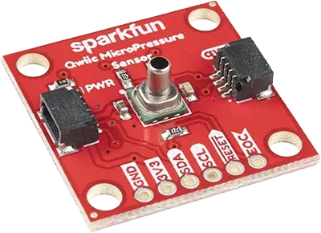

.. _sparkfun_micropressure:

Sparkfun Qwiic MicroPressure Sensor Shield
##########################################

Overview
********

The `Sparkfun Qwiic MicroPressure Sensor`_ features a Honeywell MPR series piezoresistive absolute
pressure sensor, two Qwiic connectors, and a 0.1" (2.5 mm) tube port. The on-board ASIC provides a
24-bit pressure reading over I2C at address ``0x18``.

   Sparkfun Qwiic MicroPressure Sensor (Credit: Sparkfun)

Requirements
************

This shield can be used with boards which provide an I2C connector, for example STEMMA QT or Qwiic
connectors. The target board must define a ``zephyr_i2c`` node label. See :ref:`shields` for more
details.

Pin Assignments
===============

+--------------+--------------------+
| Shield Pin   | Function           |
+==============+====================+
| GND          | Ground             |
+--------------+--------------------+
| 3V3          | Supply (1.8-3.6 V) |
+--------------+--------------------+
| SDA          | MPR I2C SDA        |
+--------------+--------------------+
| SCL          | MPR I2C SCL        |
+--------------+--------------------+
| RESET        | Sensor reset       |
+--------------+--------------------+
| EOC          | End of conversion  |
+--------------+--------------------+

This shield only provides the I2C interface. To use ``RESET`` or ``EOC``, connect them to GPIOs on
your board and extend the devicetree as needed. See :dtcompatible:`honeywell,mpr` and the `Honeywell
MPR Series`_ product page.

The default :kconfig:option:`CONFIG_MPR` choices (25 psi range, psi units, transfer function A)
match the MPRLS0025PA00001A part used on this breakout.

Programming
***********

Set ``--shield sparkfun_micropressure`` when you invoke ``west build``. For example when running the
:zephyr:code-sample:`sensor_shell` sample:

.. zephyr-app-commands::
   :zephyr-app: samples/sensor/sensor_shell
   :board: adafruit_qt_py_rp2040
   :shield: sparkfun_micropressure
   :goals: build

.. _Sparkfun Qwiic MicroPressure Sensor:
   https://www.sparkfun.com/sparkfun-qwiic-micropressure-sensor.html

.. _Honeywell MPR Series:
   https://sensing.honeywell.com/micropressure-mpr-series
