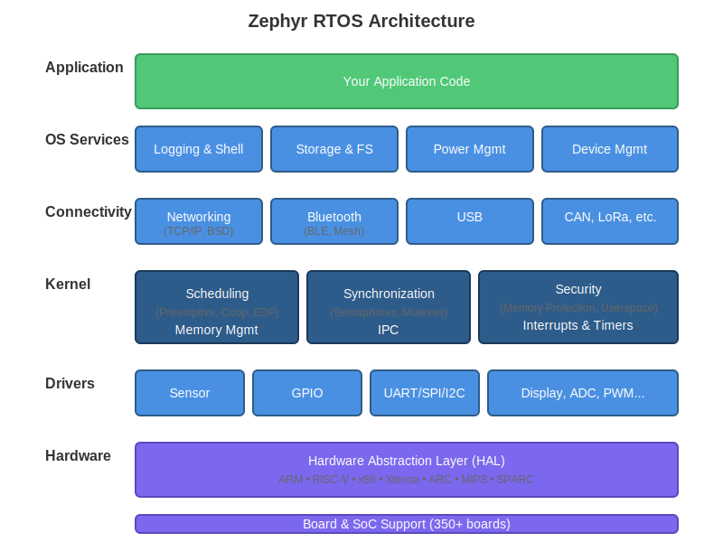

.. _introducing_zephyr:

Introduction
############

**Zephyr** is a scalable, real-time operating system (RTOS) optimized for resource-constrained embedded systems. From simple sensors and wearables to sophisticated IoT gateways and industrial controllers, Zephyr provides a small-footprint kernel with enterprise-grade features.

   High-level architecture of the Zephyr RTOS

What is Zephyr?
***************

Zephyr is a production-ready, open-source RTOS designed for the Internet of Things (IoT) and embedded applications. It offers:

* **Small footprint**: Minimal memory requirements suitable for resource-constrained devices
* **Real-time capabilities**: Deterministic scheduling and low-latency interrupt handling
* **Broad hardware support**: 10+ :ref:`architectures <architecture_porting_guide>` and 350+ :ref:`boards <boards>`
* **Rich connectivity**: :ref:`Networking <networking>`, :ref:`Bluetooth <bluetooth>`, :ref:`USB <usb>`, and more
* **Security-focused**: Built-in :ref:`security features <security_section>` including memory protection
* **Developer-friendly**: :ref:`Comprehensive tooling <developing_with_zephyr>` and extensive documentation

Supported Architectures
************************

Zephyr supports multiple CPU architectures:

* ARM (Cortex-A, Cortex-R, Cortex-M)
* RISC-V (32-bit and 64-bit)
* Intel x86 (32-bit and 64-bit)
* Tensilica Xtensa
* ARC (EM, HS, HS6X)
* SPARC V8, MIPS, and Renesas RX

See :ref:`Hardware Support <hardware_support>` for detailed architecture information and the complete list of :ref:`supported boards <boards>`.

Getting Started
***************

Ready to start developing with Zephyr?

1. **Installation**: Follow the :ref:`getting_started` guide to set up your development environment
2. **First Application**: Build your first application with the :ref:`beyond-gsg` tutorial
3. **Samples**: Explore sample applications in the ``samples/`` directory
4. **API Documentation**: Browse the :ref:`api_overview` for detailed API references

See the :ref:`developing_with_zephyr` section for comprehensive development documentation.

Licensing
*********

Zephyr is permissively licensed under the `Apache 2.0 license`_ (see the ``LICENSE`` file in the project's `GitHub repo`_). Some imported or reused components use other licenses as described in :ref:`Zephyr_Licensing`.

.. _Apache 2.0 license:
   https://github.com/zephyrproject-rtos/zephyr/blob/main/LICENSE

.. _GitHub repo: https://github.com/zephyrproject-rtos/zephyr

Community and Support
*********************

Join the Zephyr community:

* **Discord**: Real-time discussions at https://chat.zephyrproject.org
* **Mailing Lists**: Subscribe to users@lists.zephyrproject.org or devel@lists.zephyrproject.org
* **GitHub**: Report issues and contribute at https://github.com/zephyrproject-rtos/zephyr

See :ref:`contribute_guidelines` for information on contributing to Zephyr.

Key Features
************

.. _zephyr_intro_configurability:

**Modular and Configurable**
   Highly configurable kernel allows applications to include only needed capabilities, optimizing for size and performance. See :ref:`application` for configuration details.

**Real-Time Kernel Services**
   The :ref:`Zephyr kernel <kernel>` provides essential RTOS services:

   * Preemptive and cooperative :ref:`scheduling <scheduling_v2>` with multiple algorithms (priority-based, EDF, timeslicing)
   * :ref:`Threads <threads_v2>` with POSIX pthreads compatibility
   * :ref:`Synchronization primitives <semaphores_v2>` (semaphores, mutexes, condition variables)
   * :ref:`Inter-thread communication <message_queues_v2>` (message queues, pipes, mailboxes)
   * :ref:`Memory management <memory_management_api>` (static and dynamic allocation)
   * :ref:`Interrupt handling <interrupts_v2>` with nested interrupt support

**Connectivity Stacks**
   Production-ready :ref:`connectivity <connectivity>` options:

   * :ref:`Networking <networking>`: Full TCP/IP stack with BSD sockets, IPv4/IPv6, TLS, HTTP, MQTT, CoAP
   * :ref:`Bluetooth <bluetooth>`: BLE 5.x Controller and Host, Bluetooth Mesh, qualified profiles
   * :ref:`USB <usb>`: Device and Host support with multiple device classes
   * Additional protocols: :ref:`CAN <canbus>`, :ref:`LoRaWAN <lora_lorawan>`, :ref:`Modbus <modbus>`

**OS Services**
   Rich set of :ref:`OS services <os_services>` for application development:

   * :ref:`Logging <logging_api>`: Multi-backend logging with filtering and panic mode
   * :ref:`Shell <shell_api>`: Interactive command-line interface with autocompletion
   * :ref:`File Systems <file_system_api>`: FAT, ext2, LittleFS support with VFS interface
   * :ref:`Power Management <pm-guide>`: System and device-level power management
   * :ref:`Storage <storage_reference>`: NVS, FCB, and settings subsystems for persistent data

**Security and Safety**
   Built-in :ref:`security features <security_section>`:

   * Memory protection with MMU/MPU support
   * Userspace and memory domains for thread isolation
   * Stack overflow protection
   * Secure coding practices and vulnerability management
   * Optional :ref:`TF-M integration <tfm>` for Arm TrustZone

**Hardware Abstraction**
   :ref:`Device driver model <device_model_api>` with:

   * Consistent API across platforms
   * :ref:`Devicetree <dt-guide>` for hardware description
   * 100+ sensor, actuator, and peripheral drivers
   * Optimized for code reuse across SoCs

**Development Tools**
   Comprehensive :ref:`development environment <developing_with_zephyr>`:

   * Cross-platform :ref:`build system <build_overview>` (CMake/Ninja)
   * :ref:`West <west>` meta-tool for project management
   * Native simulation (:zephyr:board:`native_sim`) for Linux/macOS/Windows development
   * Integration with popular IDEs and debuggers
   * Extensive :ref:`testing infrastructure <testing>`

.. include:: ../../README.rst
   :start-after: start_include_here

Learn More
**********

* :ref:`Kernel Services <kernel>`: Detailed kernel documentation
* :ref:`Connectivity <connectivity>`: Networking, Bluetooth, USB, and more
* :ref:`OS Services <os_services>`: Logging, shell, storage, power management
* :ref:`Hardware Support <hardware_support>`: Architecture and board documentation
* :ref:`Security <security_section>`: Security features and best practices
* :ref:`API Reference <api_overview>`: Complete API documentation
* :ref:`glossary`: Definitions of key terms and concepts
