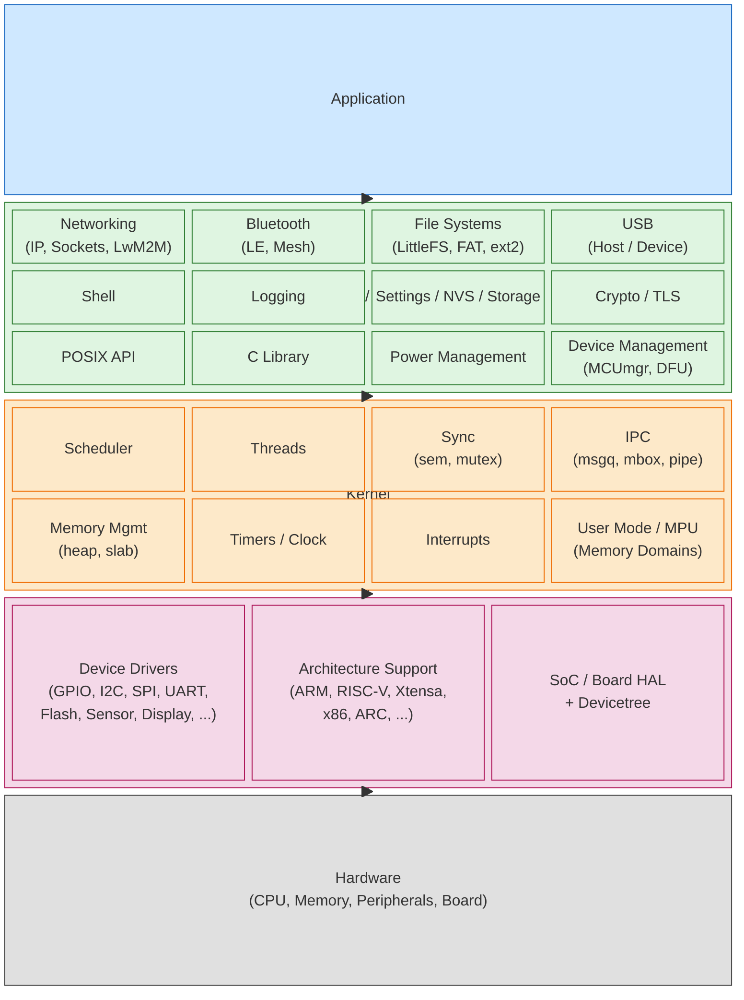

# Zephyr RTOS - Simplified Layered Architecture

A simplified, top-down view of the main Zephyr RTOS "layers", from the user's
application down to the hardware. Rendered with Mermaid's
[`block-beta`](https://mermaid.js.org/syntax/block.html) diagram syntax.

## Notes

- **Application** - user code built on top of Zephyr APIs.
- **Subsystems / OS Services** - optional, modular features that an app opts
  into via Kconfig (networking, Bluetooth, file systems, shell, logging,
  POSIX, C library, power management, device management, ...).
- **Kernel** - the small core: scheduler, threads, synchronization, IPC,
  memory, timers, interrupts and user-mode/MPU isolation.
- **HAL / Drivers / Architecture** - the device driver model, per-architecture
  code, SoC/vendor HALs, and the Devicetree-derived hardware description used
  to wire everything to the board.
- **Hardware** - the actual SoC, memory and peripherals on the board.
