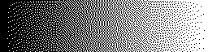
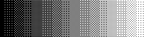
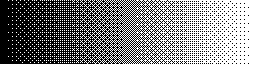

.. zephyr:code-sample:: libdither
   :name: libdither dithering sample
   :relevant-api: display_interface

   Render a dithered gradient on a display, cycling through multiple algorithms.

Overview
********

This sample demonstrates the `libdither`_ library by generating a
black-to-white horizontal gradient and applying four dithering algorithms to it
in a loop:

* **Floyd-Steinberg** — error diffusion; smooth, organic appearance.
* **Atkinson** — error diffusion variant; slightly lighter, characteristic
  dot clusters.
* **Bayer 4×4** — ordered (threshold matrix); fast, deterministic crosshatch
  pattern.
* **Bayer 8×8** — ordered (larger matrix); finer crosshatch with less
  visible tiling.

The dithered 1-bit output is written to the display using Zephyr's
:ref:`display driver API <display_api>`. All standard Zephyr pixel formats are
supported — monochrome vertically-tiled (e.g. SSD1306), RGB565, RGB888,
L_8, and ARGB/RGBA/BGRA 8888 variants.

Input gradient
==============

   Input: smooth black-to-white gradient

Dithering results
=================

   Floyd-Steinberg error diffusion

   Atkinson error diffusion

   Bayer 4×4 ordered dithering

   Bayer 8×8 ordered dithering

Requirements
************

* A board with a display (any pixel format supported by Zephyr's display
  driver API).
* The ``libdither`` west module — see `Setting up the module`_ below.

Setting up the module
*********************

``libdither`` is not part of Zephyr's default west workspace.  The upstream
repository (`robertkist/libdither`_) needs a small :file:`zephyr/` directory
containing a :file:`module.yml`, :file:`CMakeLists.txt`, and :file:`Kconfig`
to be recognised by Zephyr's module system.

The required files are provided under
:file:`samples/modules/libdither/module-fork-files/zephyr/` in this
repository.  Copy them into a fork of ``libdither``, push the fork, and update
the ``revision:`` field in :file:`west.yml` to the resulting commit SHA.  Then
fetch the module with:

.. code-block:: console

   west update libdither

Memory requirements
*******************

``libdither`` stores the source image as an array of ``double`` values
(8 bytes per pixel) plus a 1-byte transparency channel.  For a 128×64 display
this requires approximately 72 KB of heap.  The default
:kconfig:option:`CONFIG_HEAP_MEM_POOL_SIZE` for this sample is 128 KB, which
covers displays up to 128×64.  Increase it for larger displays.

Building and Running
********************

The sample runs out-of-the-box on ``native_sim`` using the SDL virtual display:

.. zephyr-app-commands::
   :zephyr-app: samples/modules/libdither
   :host-os: unix
   :board: native_sim
   :goals: run
   :compact:

For a 64-bit host machine:

.. zephyr-app-commands::
   :zephyr-app: samples/modules/libdither
   :host-os: unix
   :board: native_sim/native/64
   :goals: run
   :compact:

For a board with a physical display (e.g. an SSD1306 OLED on I²C):

.. zephyr-app-commands::
   :zephyr-app: samples/modules/libdither
   :board: <your_board>
   :goals: build flash
   :compact:

Sample output
*************

The sample cycles through the four algorithms, sleeping two seconds between
each, and prints its progress over the serial console:

.. code-block:: console

   [00:00:00.000,000] <inf> libdither_sample: Display: 320x240
   [00:00:00.001,000] <inf> libdither_sample: Applying Floyd-Steinberg dithering...
   [00:00:02.001,000] <inf> libdither_sample: Applying Atkinson dithering...
   [00:00:04.001,000] <inf> libdither_sample: Applying Bayer 4x4 ordered dithering...
   [00:00:06.001,000] <inf> libdither_sample: Applying Bayer 8x8 ordered dithering...
   [00:00:08.001,000] <inf> libdither_sample: libdither sample done

After one full cycle the sample loops indefinitely.

References
**********

.. target-notes::

.. _libdither: https://github.com/robertkist/libdither
.. _robertkist/libdither: https://github.com/robertkist/libdither
