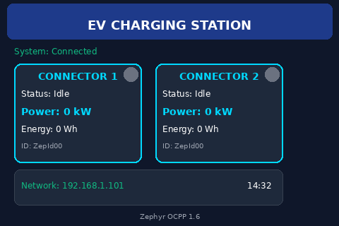
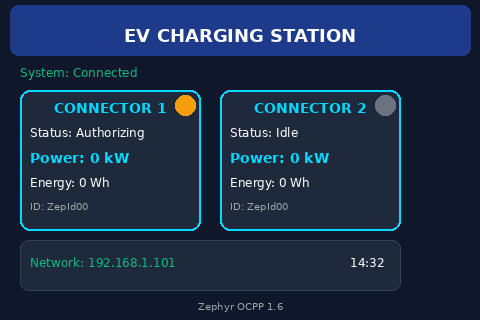
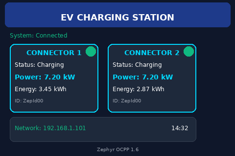
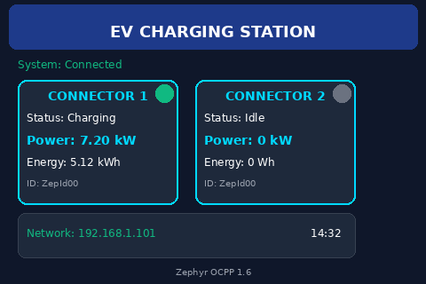

.. zephyr:code-sample:: ocpp
   :name: OCPP charge point
   :relevant-api: ocpp_api

   Implement an OCPP charge point that connects to a Central System server and
   simulates the meter readings.

Overview
********

Open Charge Point Protocol (OCPP) is an application protocol for communication
between Charge Points (Electric vehicle (EV) charging stations) and a central
management system, also known as a charging station network.

This ocpp sample application for Zephyr implements the OCPP library
and establishes a connection to an Central System server using the web socket.

An optional LVGL-based graphical user interface (GUI) is available to visualize
the charging station status, connector states, and energy readings in real-time.

The source code for this sample application can be found at:
:zephyr_file:`samples/net/ocpp`.

Requirements
************

- Linux machine
- STM32 Discovery kit (32F769IDISCOVERY) or any network interface device
- SteVe Demo Server (<https://github.com/steve-community/steve/blob/master/README.md>)
- LAN for testing purposes (Ethernet)

Building and Running
********************

Build the ocpp sample application like this:

.. zephyr-app-commands::
   :zephyr-app: samples/net/ocpp
   :board: <board to use>
   :goals: build
   :compact:

The sample application is to built and tested on

.. code-block:: console

	west build -b stm32f769i_disco
	west flash

The output of sample is:

.. code-block:: console

	*** Booting Zephyr OS build v3.6.0-rc1-37-g8c035d8f24cf ***
	OCPP sample stm32f769i_disco
	[00:00:02.642,000] <inf> net_dhcpv4: Received: 192.168.1.101
	[00:00:02.642,000] <inf> main: net mgr cb
	[00:00:02.642,000] <inf> main: Your address: 192.168.1.101
	[00:00:02.642,000] <inf> main: Lease time: 86400 seconds
	[00:00:02.642,000] <inf> main: Subnet: 255.255.255.0
	[00:00:02.643,000] <inf> main: Router: 192.168.1.1
	[00:00:07.011,000] <inf> main: cs server 122.165.245.213 8180
	[00:00:07.011,000] <inf> main: IPv4 Address 122.165.245.213
	[00:00:07.024,000] <inf> main: sntp succ since Epoch: 1707890823
	[00:00:07.024,000] <inf> ocpp: upstream init
	[00:00:07.025,000] <inf> ocpp: ocpp init success
	[00:00:17.066,000] <inf> main: ocpp auth 0> idcon 1 status 1
	[00:00:17.101,000] <inf> main: ocpp auth 0> idcon 2 status 1
	[00:00:17.197,000] <inf> main: ocpp start charging connector id 1
	[00:00:17.255,000] <inf> main: ocpp start charging connector id 2
	[00:01:07.064,000] <inf> main: ocpp stop charging connector id 1
	[00:01:08.063,000] <inf> main: ocpp stop charging connector id 2

Building with LVGL GUI
***********************

To build the sample with the LVGL GUI support, use the ``prj_gui.conf`` configuration:

.. zephyr-app-commands::
   :zephyr-app: samples/net/ocpp
   :board: native_sim
   :goals: build
   :gen-args: -DCONF_FILE=prj_gui.conf
   :compact:

For native_sim (simulator), you can run the application directly:

.. code-block:: console

	west build -b native_sim -DCONF_FILE=prj_gui.conf
	./build/zephyr/zephyr.exe

The GUI will display:

- Charging station status and connection state
- Two connector cards showing real-time status (Idle, Authorizing, Charging)
- Power consumption in kW
- Energy delivered in Wh/kWh
- Network status with IP address
- Current time display

The GUI features a modern EV charging station theme with:

- Dark blue background for easy viewing
- Bright cyan accents for charging indicators
- Color-coded status indicators (green for active, amber for warnings, gray for idle)
- Real-time updates as charging sessions progress

GUI Screenshots
***************

Initial State (Both Connectors Idle):

Connector Authorizing:

Both Connectors Charging:

Mixed State (One Charging, One Idle):

