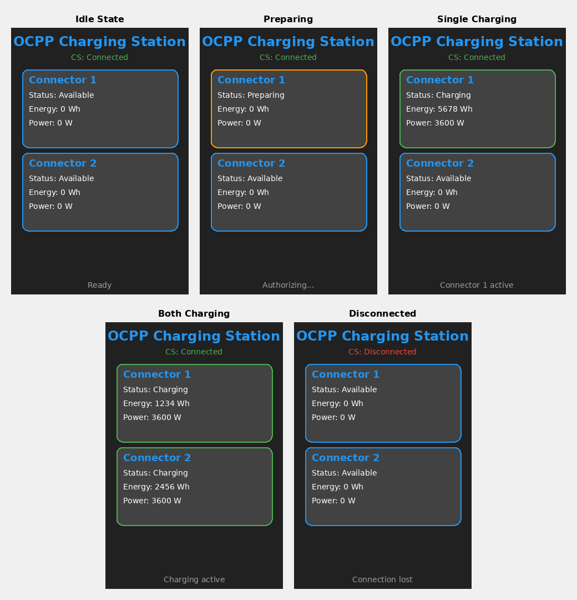
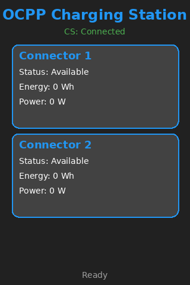
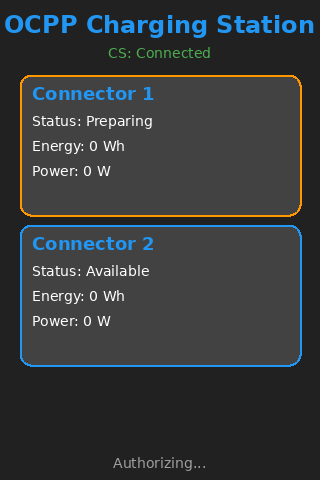
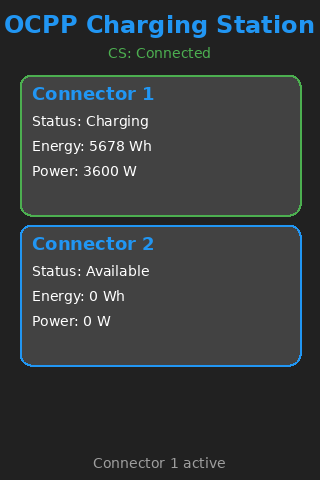
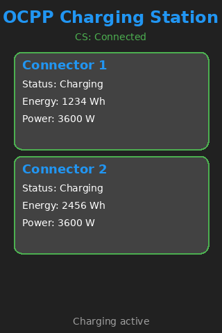

.. zephyr:code-sample:: ocpp
   :name: OCPP charge point
   :relevant-api: ocpp_api

   Implement an OCPP charge point that connects to a Central System server and
   simulates the meter readings. Features an optional modern LVGL graphical interface.

Overview
********

Open Charge Point Protocol (OCPP) is an application protocol for communication
between Charge Points (Electric vehicle (EV) charging stations) and a central
management system, also known as a charging station network.

This ocpp sample application for Zephyr implements the OCPP library
and establishes a connection to an Central System server using the web socket
protocol.

The sample includes an optional LVGL-based graphical user interface that displays:

- Real-time charging station status
- Individual connector states (Available, Preparing, Charging, Finishing)
- Energy meter readings (Wh) for each connector
- Power consumption (W) for active charging sessions
- Central System connection status
- Visual indicators with color-coded borders (blue for available, green for charging, orange for preparing)

The source code for this sample application can be found at:
:zephyr_file:`samples/net/ocpp`.

LVGL GUI Screenshots
********************

The LVGL GUI provides a modern, dark-themed interface optimized for embedded displays:

*Complete showcase of all GUI states*

*Idle state: Both connectors available, connected to Central System*

*Preparing state: Connector 1 authorizing before charging*

*Single charging: Connector 1 actively charging*

*Dual charging: Both connectors actively charging*

Requirements
************

- Linux machine
- STM32 Discovery kit (32F769IDISCOVERY) or any network interface device with display (for LVGL GUI)
- native_sim board (for testing LVGL GUI without hardware)
- SteVe Demo Server (https://github.com/steve-community/steve/blob/master/README.md)
- LAN for testing purposes (Ethernet)

Building and Running
********************

Standard Build (without GUI)
=============================

Build the ocpp sample application like this:

.. zephyr-app-commands::
   :zephyr-app: samples/net/ocpp
   :board: <board to use>
   :goals: build
   :compact:

The sample application is to built and tested on

.. code-block:: console

	west build -b stm32f769i_disco
	west flash

Building with LVGL GUI
=======================

The LVGL GUI is automatically enabled when building for boards with display support.
For native_sim (simulator with SDL display):

.. code-block:: console

	west build -b native_sim samples/net/ocpp

The GUI will display on your host machine using SDL. This is useful for:

- Demonstrating the GUI design without hardware
- Testing UI updates and state transitions
- Taking screenshots for documentation

For hardware with display support:

.. code-block:: console

	west build -b <board_with_display>
	west flash

The LVGL configuration is controlled via Kconfig options in the board-specific
configuration files (``boards/native_sim.conf``).

Sample Output
*************

The output of sample is:

.. code-block:: console

	*** Booting Zephyr OS build v3.6.0-rc1-37-g8c035d8f24cf ***
	OCPP sample stm32f769i_disco
	[00:00:02.642,000] <inf> net_dhcpv4: Received: 192.168.1.101
	[00:00:02.642,000] <inf> main: net mgr cb
	[00:00:02.642,000] <inf> main: Your address: 192.168.1.101
	[00:00:02.642,000] <inf> main: Lease time: 86400 seconds
	[00:00:02.642,000] <inf> main: Subnet: 255.255.255.0
	[00:00:02.643,000] <inf> main: Router: 192.168.1.1
	[00:00:07.011,000] <inf> main: cs server 122.165.245.213 8180
	[00:00:07.011,000] <inf> main: IPv4 Address 122.165.245.213
	[00:00:07.024,000] <inf> main: sntp succ since Epoch: 1707890823
	[00:00:07.024,000] <inf> ocpp: upstream init
	[00:00:07.025,000] <inf> ocpp: ocpp init success
	[00:00:17.066,000] <inf> main: ocpp auth 0> idcon 1 status 1
	[00:00:17.101,000] <inf> main: ocpp auth 0> idcon 2 status 1
	[00:00:17.197,000] <inf> main: ocpp start charging connector id 1
	[00:00:17.255,000] <inf> main: ocpp start charging connector id 2
	[00:01:07.064,000] <inf> main: ocpp stop charging connector id 1
	[00:01:08.063,000] <inf> main: ocpp stop charging connector id 2
