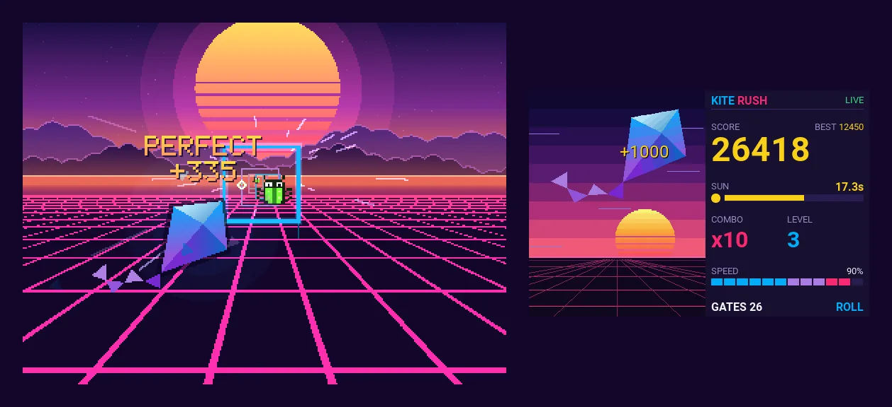

.. zephyr:code-sample:: kite_rush
   :name: Kite Rush
   :relevant-api: input_events display_interface input_interface_ext

   Play an arcade game with an RC transmitter over a CRSF link, the radio being the dashboard.

Overview
********

Kite Rush is an arcade game in which you fly the Zephyr kite through gates over a synthwave
sunset with an RC transmitter. It shows how the :dtcompatible:`tbs,crsf` input driver turns RC
channels into regular :ref:`input` events, and how an application sends telemetry back to the
radio over the same CRSF link (as used by ExpressLRS and TBS Crossfire).

The display only shows the game. The radio is the dashboard: an EdgeTX widget shows the score,
the time left, the combo and the airspeed, and plays tones and haptic feedback as you fly.

Gameplay
========

- The right stick steers the kite, the throttle sets the airspeed. Flying faster scores more, but
  leaves less time to line up with the next gate.
- The setting sun is the clock. Each gate pushes it back up, a perfect pass through the center
  pushes it further, and hitting a bug knocks it down. The game ends at sunset.
- The diamond marker shows where the kite will cross the next gate: green inside the gate, gold
  in its center.
- A full rudder flick does a barrel roll, which squashes bugs for bonus points instead of being
  hit by them.
- Every eight gates the level goes up: smaller gates, wider turns, moving gates and bugs, and a
  new sky.

To start a game, pull the throttle down, then push it up, like arming a drone. When nobody is
playing, an autopilot flies attract mode laps.

High scores
===========

A score in the top eight asks for the pilot's initials at the end of the game. The right stick
works as an arcade joystick: up and down pick the letter, right moves to the next one and left goes
back. The rudder doubles as the B (left) and A (right) buttons of a game pad. The entry saves itself
after 30 seconds.

The title screen takes turns with the high score table; move the right stick sideways to switch
between them. The table is saved with the :ref:`settings_api` (backed by :ref:`zms_api`) on the
``storage_partition`` of the board, so it survives resets. On :zephyr:board:`qemu_x86`, that
partition is a flash simulator in RAM, and boards without a storage partition keep the table in RAM.

To clear the table, hold the throttle at mid-stick with full left rudder and full up pitch on the
title screen for two seconds, which is the stick command Betaflight uses for its OSD menu. Then
enter the code set with ``CONFIG_KITE_RUSH_RESET_CODE``, ``ZAP`` by default.

The title screen also takes the Konami code, with the right stick and then the rudder for B and A.

Rendering
=========

The game is designed for 320x240 and scaled up by the largest integer factor that fits the
display, wider displays showing more of the world. It uses neither a graphics library nor a frame
buffer: each frame is a list of primitives (rectangles, gradient triangles, ellipses, lines,
sprites and text) that a scanline rasterizer draws one row at a time into a strip buffer, sized
with ``CONFIG_KITE_RUSH_STRIP_BUFFER_SIZE``. Rows are converted to the pixel format of the display:
ARGB8888, XRGB8888, RGB888, BGR888, RGB565, RGB565X or L8. The kite is drawn from the triangles of
the Zephyr logo. For a display mounted the other way round, ``CONFIG_KITE_RUSH_ROTATE_180`` turns
the picture and the touchscreen upside down, at no cost: each row is mirrored as it is converted,
and the strips go to the display bottom up.

On displays behind a slow link, such as SPI panels, the transfer usually takes longer than the
drawing. The game draws the next strip while a display thread sends the previous one, which pays
off with drivers that sleep during DMA transfers (see the board files of
:zephyr:board:`wio_terminal` and :zephyr:board:`t_deck`), and only sends the rows that changed since
the previous frame. ``CONFIG_KITE_RUSH_INTERLACE`` halves the transfer further by sending even and
odd rows on alternate frames, at the cost of combing on fast motion. ``CONFIG_KITE_RUSH_PROFILE``
logs, along with the frame rate, where the frame time goes.

Controls
********

The game consumes these input events, from the CRSF driver or any other input device that reports
them, with values in microseconds (1000 to 2000, 1500 at center):

.. list-table::
   :header-rows: 1

   * - Input code
     - CRSF channel
     - Mode 2 stick
     - Function
   * - ``INPUT_ABS_RX``
     - 1, aileron
     - Right, horizontal
     - Steer
   * - ``INPUT_ABS_RY``
     - 2, elevator
     - Right, vertical
     - Climb and dive
   * - ``INPUT_ABS_THROTTLE``
     - 3, throttle
     - Left, vertical
     - Airspeed, down then up to start a game
   * - ``INPUT_ABS_RUDDER``
     - 4, rudder
     - Left, horizontal
     - Barrel roll at full deflection

Enable ``CONFIG_KITE_RUSH_INVERT_PITCH`` to pull the stick back to climb. The game pauses when no
CRSF frame arrived for 500 ms.

Without a radio
===============

When no radio link is up, the keys and the touchscreen of the board fly the kite, at a steady
airspeed. The touchscreen is the ``zephyr,touch`` chosen node.

- ``INPUT_KEY_UP``, ``INPUT_KEY_DOWN``, ``INPUT_KEY_LEFT`` and ``INPUT_KEY_RIGHT``, as joysticks and
  trackballs report them, or a drag on the touchscreen, around where the finger came down, move the
  right stick: steer in flight, pick letters and move between them in the name entry.
- ``INPUT_KEY_ENTER`` or ``INPUT_BTN_START``, or a tap, starts a game. In flight, it does a barrel
  roll, towards the side of the screen that was tapped.
- ``INPUT_BTN_B`` and ``INPUT_BTN_A`` move the rudder left and right. Holding B and up opens the
  reset screen.

On the :zephyr:board:`wio_terminal`, the 5-way switch steers, and the top buttons labeled B and A
act as on a game pad, C being the action key. In QEMU, the mouse is the touchscreen. A radio pilot
who loses the link in the middle of a game is waited for, unless someone takes over on the board.

Telemetry
*********

The game reports to the radio with :c:func:`input_crsf_send_telemetry`:

- CRSF Game frames (type ``0x3C``, extended header, from the flight controller ``0xC8`` to the
  radio ``0xEA``):

  - Sub-command ``0x01``, add points, as defined by the CRSF specification: int16 score delta.
  - Sub-command ``0x02``, command code, as defined by the CRSF specification: uint16 with the event
    in the high byte and its argument in the low byte (``enum game_event`` in
    :zephyr_file:`samples/subsys/input/kite_rush/src/game.h`).
  - Sub-command ``0x10``, specific to this sample: phase, level, score, best score, time left,
    combo, airspeed, gates passed, kite roll and altitude (see
    :zephyr_file:`samples/subsys/input/kite_rush/src/telemetry.c`).

- Flight mode frames (``0x21``) with the game phase and attitude frames (``0x1E``) with the
  attitude of the kite, which show on the regular telemetry screens of the radio.

EdgeTX does not decode frame type ``0x3C`` itself and hands it to Lua scripts through
``crossfireTelemetryPop()``.

Requirements
************

- A display, set as the ``zephyr,display`` chosen node.
- A CRSF receiver on a UART, described by a :dtcompatible:`tbs,crsf` node, or keys or a touchscreen
  on the board.
- For the dashboard, an EdgeTX radio with a color screen, or the EdgeTX simulator.

The :zephyr:board:`qemu_x86` board needs no hardware: the game runs on its ramfb display, and its
second serial port, used by the CRSF driver, is served on TCP port 5760 for the radio side. ramfb
needs a QEMU build with a graphical display backend, see :dtcompatible:`qemu,ramfb`.

Building and Running
********************

QEMU and the EdgeTX simulator
=============================

Build and run the game:

.. zephyr-app-commands::
   :zephyr-app: samples/subsys/input/kite_rush
   :host-os: unix
   :board: qemu_x86
   :goals: run
   :compact:

Then start the EdgeTX simulator of `edgetx-cli`_ with its CRSF link to QEMU, from the ``edgetx``
directory of the sample, so that it installs the dashboard widget:

.. code-block:: console

   cd samples/subsys/input/kite_rush/edgetx
   ./sim-setup.sh jumper-t15
   edgetx-cli dev simulator --radio jumper-t15 --crsf tcp:127.0.0.1:5760

``sim-setup.sh`` makes the Kite Rush model the current model of the simulated radio and selects
stick mode 2. The simulator streams the stick positions to QEMU as CRSF channel frames, and feeds
the telemetry of the game to the radio. It retries until QEMU is up.

Other boards
============

The board files of the sample put the receiver on these pins. Connect the TX pin of the receiver to
the RX pin of the board and the other way round, and power the receiver from the board.

.. list-table::
   :header-rows: 1

   * - Board
     - Receiver UART
   * - :zephyr:board:`wio_terminal`
     - 40-pin header, pins 8 (TX) and 10 (RX)
   * - :zephyr:board:`m5stack_core2`
     - Grove port A, GPIO32 (TX) and GPIO33 (RX)
   * - :zephyr:board:`t_deck`
     - Grove port, GPIO43 (TX) and GPIO44 (RX). The T-Deck Plus has its GNSS module on these pins.
   * - :zephyr:board:`uedx80480070e_wb_a`
     - Side headers, GPIO17 (TX) and GPIO18 (RX)

On another board, give the UART of the receiver the ``crsf_uart`` label in a board overlay and
include :zephyr_file:`samples/subsys/input/kite_rush/boards/crsf_receiver.dtsi`, which maps the
channels in AETR order, as
:zephyr_file:`samples/subsys/input/kite_rush/boards/qemu_x86.overlay` does.

``CONFIG_KITE_RUSH_AUTOPLAY`` lets the autopilot play complete games, to check a board without a
radio.

Radio dashboard
***************

The :zephyr_file:`samples/subsys/input/kite_rush/edgetx` directory holds the EdgeTX package of the
dashboard:

- ``WIDGETS/KiteRush``, a widget for color screen radios that turns the telemetry into the
  dashboard. It adapts to the size of its zone, from full screen to a small summary.
- ``MODELS/kiterush.yml``, a model that shows the widget full screen, with channel order AETR:
  channel 1 aileron, 2 elevator, 3 throttle, 4 rudder, 5 to 8 switches SA to SD. It uses the
  internal module in CRSF mode.

On a radio:

#. Copy ``WIDGETS/KiteRush`` to ``/WIDGETS/KiteRush`` on the SD card.
#. Copy ``MODELS/kiterush.yml`` to ``/MODELS`` under an unused ``modelN.yml`` name, or set up a
   model with the channel order above, a CRSF module (ExpressLRS or TBS Crossfire), and a main view
   showing the KiteRush widget full screen. On radios without an internal CRSF module, use the
   external module instead.
#. Bind the receiver connected to the Zephyr board, and use stick mode 2.

.. _edgetx-cli: https://github.com/jurgelenas/edgetx-cli
